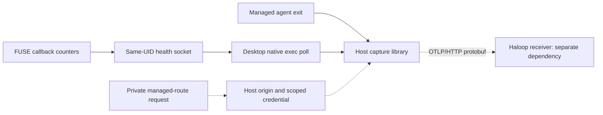

# Openrind Capture

## Select The Path

Read [README: Capture And Haloop](../../../README.md#capture-and-haloop),
[BUILD: OTLP Capture Library Tests](../../../BUILD.md#otlp-capture-library-tests),
and the [package contract](../../../openrind-desktop/packages/capture/README.md).
Run host commands on the host, never inside a customer owner. A bundled copy of
this skill does not make the library or host tools available inside that owner.

- For a key-free proof, run unit tests and the real Collector fixture.
- For managed diagnostics, use BUILD's **Runtime Diagnostic Setup**. The supplied
  Haloop release has no matching receiver. A missing route and a control-path
  failure have different status codes. Do not infer OTLP support from its
  inference URL or private JSON ingestion endpoint.
- For Claude launch and model routing, use `openrind-shell`. Telemetry tests do
  not replace its required Haloop setup.

State the host OS, Node/pnpm versions, Docker context, selected path, and missing
prerequisites. Do not read repository `.env` or provider keys for key-free tests.
Do not claim full capture from the target specification.

## Key-Free Validation

Use Node.js 22.19 or later and pnpm 10.27.0. Both tests need local TCP sockets.
The collector fixture also needs a Linux host or WSL shell and a local Linux
Docker daemon. It uses UID/GID and bind mounts; remote Docker or native Windows
Node is not this setup. Follow BUILD's dependency setup first.

From the repository root:

```bash
cd openrind-desktop
pnpm install --filter @openrind/capture --frozen-lockfile
pnpm --filter @openrind/capture test
pnpm --filter @openrind/capture test:collector
```

Require exit code 0. Record the actual unit count. The collector receipt must
show `result: "passed"`, 6 logs, 3 spans, a 17,825,792-byte reconstructed payload,
and logs/traces/metrics. It verifies chunk hashes and trace parents. Diagnostic
samples are synthetic, not from a live FUSE mount.

The script removes its own container and temporary directory. Retain its printed
receipt if requested; there is no persistent evidence directory. Report blocked
tests. Do not weaken restrictions or delete unrelated resources to pass. No
NVIDIA image build is needed.

## Runtime Diagnostics



Desktop requests `POST /diagnostics/route` on launch through its existing private
control path. No customer environment variable or new WSL service is needed.
The current receiver reports unsupported. Do not hide that state or invent an
endpoint. The package README defines the client contract for the Haloop team.
Valid configuration loads the bundled SDK. Invalid or missing support does not
load it or start polls. Credentials stay in host memory and renew per sandbox.
`OPENRIND_DIAGNOSTICS_OTLP_ENDPOINT` and
`OPENRIND_DIAGNOSTICS_OTLP_AUTHORIZATION` remain standalone library test inputs.
Desktop ignores them. Never inject diagnostic authorization into an owner.
Keep normal proxy selection and TLS validation. Never remove required Haloop
inference routing to make diagnostics pass.

One poll serves concurrent sessions in the same sandbox. It runs after initialization and
every 30 seconds without overlap. The last session exit stops it. At most 32
sandboxes are watched. Receiver failures must not block agent launches or FUSE.
Older daemons report health without counters; do not replace a live sandbox to
hide that limit.

Check `runtimeDiagnostics.routes` and `recent` in Haloop status. `ready` means
initialized, not delivered. Distinguish `receiver_unsupported`, `route_invalid`,
`route_unauthorized`, and `route_unavailable`. A later launch retries discovery.
Confirm receiver-side spans before claiming delivery. Report poll
failures separately from exporter errors. Do not log raw health error strings,
database URLs, headers, or file contents. Diagnostics export only approved fields.

## Evidence And Limits

- Record-call `accepted: true` means local admission, not storage.
- `localStatus: "pending"` means no known local loss, not completion.
- `degraded` means evidence rejection or export failure. Later success does not
  erase loss. Metric failures have separate counters.
- `persistentAcceptance: "unverified"` is expected after flush and shutdown.
- FUSE counters reset per daemon and are approximate under concurrency. They do
  not count all syscalls or provide file-version history.
- Health is same-UID diagnostic output, not trusted execution evidence.
- FUSE `flush-all` commits project files; telemetry flush does not. Never add a
  watcher on `/sandbox/work` or a second PostgreSQL path for diagnostics.

Browser/CDP payload capture, file history, model capture through this library,
durable acknowledgement, and capture-profile completeness are not implemented.
Windows Desktop with a live PostgreSQL-backed mount needs separate validation.

## Change And Test

Inspect `openrind-desktop/packages/capture/src/diagnostics.mjs` for field mapping,
`openrind-desktop/apps/desktop/electron/openshell/runtime-diagnostics.mjs` for
polling, and `crates/openeral-fused/src/diagnostics.rs` for counters.

Read the package API before changing queues, header callbacks, or retries. The
library does not install global OTel providers or automatic instrumentation.
Keep model spans owned by the inference gateway; do not duplicate them.

After edits, run capture tests, the real Collector fixture, Desktop OpenShell
tests, `test:diagnostics:electron`, and Electron typecheck. The Electron command
builds the lazy bundle and tests with Electron 35's Node 22.16. The isolated ASAR
test is not a full packaged GUI startup test. Check both child-process errors
and exit status when running tests. Run FUSE tests and Clippy for filesystem changes.
Report each test separately. Keep README, BUILD, and architecture aligned with
implemented behavior, not planned features.
