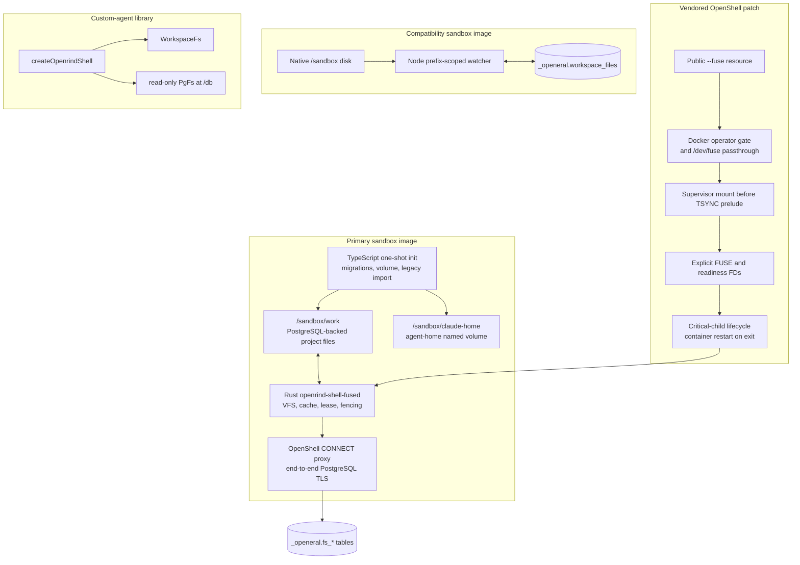

# Openrind Shell Development

Paths below are relative to the repository root. Read `CLAUDE.md`, `README.md`,
and the relevant section of `BUILD.md` first. Read `ARCHITECTURE.md` before runtime
changes and `FUSE-DESIGN.md` before changing FUSE. Keep primary FUSE, compatibility,
the custom-agent library, and browser-only fixtures distinct.

## Fresh Checkout

1. Check the operating system and Docker context. The managed Desktop installer
   targets Windows 11/WSL2. The browser-only live fixture was tested on Linux x64.
2. Select the requested path. For a first browser proof, use BUILD's **Real Linux
   Browser Test**. It does not need Desktop, `/dev/fuse`, PostgreSQL, Haloop, or keys.
3. Follow the dependency and image steps in that section. Keep the package-manager
   choice consistent. Confirm Docker server access, not only `docker --version`.
4. If a prerequisite fails, report the command and error before further work.
   Do not skip a live test, invent an image tag, or select a weaker runtime.
5. Record what ran and what did not. Source inspection is not a runtime result.

For Windows source setup, BUILD's **Windows Desktop Source Setup** lists the
required rootfs and external Haloop source. Stop and report missing assets.
Do not follow historical Tauri setup or change branches to obtain an older flow.

### Capture And Diagnostics

For OTLP work, use `openrind-capture` and BUILD's **OTLP Capture Library Tests**.
The key-free host fixture needs no OpenShell build or PostgreSQL. Desktop has a
managed route client for lifecycle spans and sampled FUSE health. The supplied
Haloop release has no matching receiver. Environment variables do not activate
Desktop export. Test the lazy bundle with `test:diagnostics:electron`; it uses
Electron's Node runtime and an isolated ASAR. This is not a full installer test.
FUSE counters contain no paths or contents. Full browser/file evidence and
durable Haloop ingestion are not implemented.

Keep export off the FUSE request path. Never add a watcher, second database
connection, or TLS bypass for telemetry. Export failure must not change storage
results. Run Rust tests for counters, Desktop tests for polling, and the Collector
fixture for wire interoperability. None proves Windows Desktop with live FUSE.

### Choose A Browser Test

These commands run on the Linux host, not inside an existing customer owner.
Complete the public test setup before adding either SDK or private Argide input.

| Requested result | Guide and runner flags | Required input | Passing evidence |
|---|---|---|---|
| Real agent-browser | [Real Linux Browser Test](../../../BUILD.md#real-linux-browser-test); no flags | Local Docker and matched build tools/images; no keys | 17 checks and `page.png` |
| Configured Hyperbrowser SDK | [Hyperbrowser SDK Test](../../../BUILD.md#hyperbrowser-sdk-test); `--hyperbrowser` | Rebuilt SDK-capable fixture images; no keys | 26 checks and `hyperbrowser.json` |
| Actual Argide browser module | [Argide guide](../../../openrind-desktop/packages/browser-pods/test/live/argide/README.md); `--argide` | Pinned private kit and derived owner image; no model key | 23 checks and `argide.json` |
| Actual Argide widget and model | Same Argide guide; `--argide --argide-widget` | Same kit plus isolated host backend and funded Gemini key | 28 checks, `argide-widget.json`, and `argide-widget.png` |
| Openrind browser CTF runtime | [CTF Runtime](../../../openrind-desktop/packages/ctf-runtime/README.md); use `openrind-ctf` | Linux x64 and local Docker; model run needs `OPENROUTER_API_KEY`; FUSE mode also needs local TLS PostgreSQL and `/dev/fuse` | Judge-backed result; `--ctf-fuse` also checks capture hashes after owner recreation |

Each count includes the Kernel checks. Do not add the counts or combine flags
to claim the same receipt. Every mode also requires exit code 0,
`result: passed`, and no `cleanupError`. If the private kit is missing, report
that limit. Do not silently substitute the SDK fixture for actual Argide.

The standard `--ctf` live test uses a non-FUSE owner. Use `--ctf-fuse` to run
the real agent and both browser challenges in a primary FUSE owner. That mode
flushes the trajectory and event files, recreates the owner with the same
workspace, and checks that all file hashes match. It does not prove Haloop
capture or Desktop integration. The runner creates its own disposable owner,
browser pods, and challenge pods. Do not point it at an existing customer
sandbox. The CTF agent sends model requests directly to OpenRouter; it is not a
managed Haloop agent. Follow `openrind-ctf` for the run procedure and evidence
checks.

## Runtime Architecture



Route a change to exactly one path unless the public contract genuinely spans paths.
Primary FUSE must never start compatibility watchers; sandbox Claude never uses the
custom-agent `WorkspaceFs` or `/db` virtual filesystem.

## Key Files

The source directories and `_openeral` database schema retain their historical names
for upgrade compatibility. Public commands and images use `openrind-shell`.

```text
crates/openeral-fused/src/
  main.rs          inherited FUSE/readiness fds, critical-process lifecycle
  runtime.rs       database coordination, state, lease/fence transitions
  connect.rs       mandatory OpenShell CONNECT + PostgreSQL TLS
  store.rs         normalized inode/dirent/chunk transactions and fencing
  cache.rs         bounded coherent dirty cache and durability barriers
  fs.rs            fuser operation implementation
  management.rs    same-UID health and flush socket

openeral-js/src/
  db/migrations.ts       V1-V8 migrations; sole migration owner and rename bridge
  db/fuse-init.ts        volume preparation, marker, legacy import, lease check
  sync.ts                compatibility prefix-scoped sync only
  shell.ts               custom-agent just-bash factory
  pg-fs/                 read-only /db virtual filesystem
  workspace-fs/          custom-agent workspace adapter

sandboxes/openeral/
  Dockerfile             primary FUSE image source
  Dockerfile.compat      compatibility image source
  setup-fuse.sh          one-shot primary initialization
  openeral-claude-fuse.sh primary Claude parent + final flush
  setup.sh               compatibility initialization
  openeral-bash.mjs      compatibility daemon/watchers
  policy.yaml            FUSE declaration and egress policy

vendor/openshell/
  UPSTREAM               source commit/tree provenance
  crates/openshell-driver-docker/
  crates/openshell-supervisor-process/
  crates/openshell-policy/
  crates/openshell-server/
```

## Non-Negotiable Boundaries

- OpenShell supervisor performs the mount before its TSYNC seccomp prelude.
- Claude receives no `/dev/fuse`, mount syscall, capability, or daemon selection.
- TypeScript owns V7 FUSE migration, V8 compatibility bridge, and import. Rust
  validates but never migrates.
- Primary persistence uses FUSE only. Never start `watchAndSync` for `/sandbox/work`.
- PostgreSQL uses OpenShell HTTP CONNECT with end-to-end TLS and no direct fallback.
- Lease loss is terminal. A fenced process never reacquires in-process.
- FUSE loop/daemon exit terminates the supervisor/container; remount is impossible.
- `_openeral` remains the storage schema until an explicit data migration exists.
- Preserve old executable and environment aliases during the public rename window.
- Ignore artifacts through `.gitignore`, never through selective commit omission.

## Build And Test

```bash
cargo fmt --all --check
cargo test -p openeral-fused
cargo clippy -p openeral-fused --all-targets -- -D warnings

cd openeral-js
pnpm install
pnpm check
```

Vendored OpenShell patch:

```bash
cd vendor/openshell
cargo fmt --all --check
cargo check -p openshell-cli -p openshell-driver-docker \
  -p openshell-policy -p openshell-supervisor-process
cargo test -p openshell-policy -p openshell-driver-docker \
  -p openshell-supervisor-process -p openshell-cli
```

The gateway binary needs `libz3.so.4` at runtime (`libz3-4`/`libz3-dev`, or
`LD_LIBRARY_PATH` to an extracted copy); see BUILD.md.

Build only the child image; do not rebuild NVIDIA's base image:

```bash
docker pull ghcr.io/nvidia/openshell-community/sandboxes/base:latest
docker build --pull=false -f Dockerfile.openrind-shell -t openrind-shell-fuse:local .
docker build --pull=false -f Dockerfile.openrind-shell-compat -t openrind-shell-compat:local .
```

Real FUSE E2E:

```bash
DATABASE_URL='postgresql://...' \
OPENSHELL_GATEWAY_ENDPOINT='http://127.0.0.1:18770' \
OPENRIND_SHELL_FUSE_E2E_IMAGE='openrind-shell-fuse:local' \
tests/fuse/test_openshell_e2e.sh
```

Without a Supabase URL, use the local TLS fixture in `tests/fuse/postgres-fixture/`
(compose + `gen-certs.sh`; see BUILD.md "Local TLS PostgreSQL Fixture") and build the
derived image with `--build-arg BASE_IMAGE=openrind-shell-fuse:local`, then set
`OPENRIND_SHELL_FUSE_E2E_IMAGE=openrind-shell-fuse-localdb:test`.

## Required FUSE Semantics

- stable inode identity across rename;
- byte-preserving names, symlinks, sparse files, and partial writes;
- open-unlinked lifetime and restart-time orphan cleanup;
- bounded shared dirty state across handles;
- `fsync`/`fdatasync` and sync-open durability;
- atomic dirty-source rename replacement;
- existing-file `O_TRUNC` close barrier;
- synchronous namespace/metadata commits;
- uncertain-commit operation deduplication;
- one-writer advisory lock, lease epoch, and terminal fencing.

## Browser-Pod Work

Read `BROWSER-PODS.md` and `openrind-desktop/packages/browser-pods/README.md` before
changing the experimental browser path. The implemented first path is the built-in
Kernel provider of pinned agent-browser. Chromium runs in a separate OpenShell
sandbox. Do not add a browser to the owner image or route browser state through FUSE.

Normal Desktop activation is still disabled. The Linux fixture passed; full
Desktop/Claude/FUSE and load tests remain. Keep unit tests, fake-CDP transport
tests, and actual client/runtime evidence distinct.
The existing Control Chrome option and user MCP settings are outside this migration.
Do not add a FUSE contract bump to retire managed browser assets.

Kernel and configured Hyperbrowser HTTP routes share one broker, session core,
owner checks, helper, and browser pod image. The adapters emulate provider APIs,
not vendor clouds. The helper is owner-local at `127.0.0.1:19300`; the broker runs
on the gateway host. SQLite stores session and cleanup records, not browser pages.

The Hyperbrowser path adds explicit uploads and download ZIPs inside the pod.
It does not translate owner paths or publish to FUSE. The pinned SDK fixture is
not extracted Argide code. The actual Argide fixture needs the supplied kit. Keep
the README's availability table, bundled browser skill, and package status
consistent with code.
Record blocked tests as blocked. Do not convert a socket or Docker permission
failure into a passing test or bypass the restriction.

Use `pnpm --filter @openrind/browser-pods test` from `openrind-desktop` for unit
tests. The separate `test:transport` command needs TCP sockets. Full setup and test
limits are in `BUILD.md` under "Experimental Browser Pods".

### Real Browser Proof

Use `openrind-desktop/packages/browser-pods/test/live/openshell-e2e.mjs`. Follow
[BUILD.md](../../../BUILD.md#real-linux-browser-test) in order, starting with host
dependencies rather than assuming `node_modules` or native binaries exist.

The fixture uses these components:

| Component | Role |
|---|---|
| Vendored CLI, gateway, supervisor | Real native OpenShell; not the stock binary on PATH |
| `test/live/Dockerfile.owner` | Browser-only agent image with helper and pinned client; no FUSE or Claude |
| `sandboxes/browser-pod/Dockerfile` | Actual headless Chromium with OpenShell network tools |
| Built-in `kernel` client provider | Sends real requests to our Kernel-compatible API, not a vendor |
| Host broker and owner loopback helper | Provider/header-authenticated route through OpenShell to the browser pod |

After completing BUILD's setup, run from the repository root:

```bash
node openrind-desktop/packages/browser-pods/test/live/openshell-e2e.mjs
```

Require exit code 0, all 17 checks, `result: passed`, no `cleanupError`, and a valid
`page.png` in the printed evidence directory. Check navigation, click/fill,
screenshots, retained sessions, proxy denial, client file-action denial, deliberate
Chromium crash replacement, resource cleanup, and 17 MiB CDP payloads in both
directions through the real proxy. Check the delayed control lease and
`wait --download` denial too. The test creates and removes only its own resources.
It does not leave a persistent browser service running.

Report the commit, platform, versions, image ID, exit code, checks, and evidence
path. Keep the evidence directory private; it contains test credentials. Do not
claim FUSE screenshot durability, a Claude skill run, Windows Desktop support,
concurrent-load latency, or Argide compatibility from this fixture.

For a debug supervisor, optimize `sha2` as BUILD documents. Cold identity checks
on Chromium can time out otherwise. Never bypass identity enforcement. The pod
requires `ip`, `nft`, and `nsenter`. Do not diagnose missing image tools as a
Docker permission failure.

For the configured SDK path, follow BUILD's **Hyperbrowser SDK Test** and add
`--hyperbrowser` to the same runner. Rebuild both fixture images first. Require
26 checks, the separate `hyperbrowser.json` receipt, and no cleanup error. Keep
the 61-second disconnect interval. This fixture uses the real SDK and Playwright,
not the Argide archive. It verifies the provider API subset, not full vendor parity.

For actual Argide, follow BUILD's **Actual Argide Application Test** and
[the fixture guide](../../../openrind-desktop/packages/browser-pods/test/live/argide/README.md).
Verify the archive,
image, and source pins. The derived owner calls the real compiled backend-core
functions, with one `baseUrl` constructor change. `--argide` requires 23 checks
and no model key. It is configured compatibility, not an unchanged-app claim.

The optional `--argide --argide-widget` test requires the real host backend and
a funded Gemini key. Use a new Compose project and keep the guide's variables
in the same host Bash session. Seed only that new test database. Do not load the
repository `.env` or change model providers without user direction. Confirm backend
readiness and the seeded product configuration before the model test. A ready
HTTP server does not prove that the model key works.

The actual backend, MongoDB, Redis, and Qdrant run in host Docker. Model calls
go directly to Gemini outside OpenShell and Haloop. The actual widget and form
run inside the OpenShell browser pod. Only their website/API traffic uses the
pod's OpenShell policy. Do not claim that the whole application runs in OpenShell.

Require 28 checks, real tool dispatch, `chat.finish`, and a screenshot of the
submitted form. The driver must not fill the form itself. Keep automatic approval
limited to that test page. The runner deletes its OpenShell test resources; it
does not stop the host backend. Run the guide's separate Compose shutdown even
after a failed test. Keep the private kit unchanged and evidence private.
Do not copy private code or keys into this repository.
This result does not prove the Auth0 dashboard, RAG, arbitrary websites,
Windows Desktop activation, Claude integration, or FUSE export.

The SDK upload returns a browser-local path. Use CDP `DOM.setFileInputFiles` for
that path. Playwright `setInputFiles(path)` checks the owner filesystem first.
Do not add local-file translation to hide that difference. Run the pod-side file
tests under `sandboxes/browser-pod` for limits, cancellation, and unsafe entries.

### Persistent Host Setup

Read BUILD's **Broker Process** and **Owner Activation** before configuring an
existing owner. There is no complete production installer yet. The live runner
is the executable setup example, not an installer for the user's current sandbox.

Stage 0 requires a trusted single-user host. Native CLI forwards expose
unauthenticated CDP ports on host loopback. Do not claim host-process isolation.
For an uncertain create, use BUILD's **Resolve Uncertain Creates** procedure.
Keep its quota reserved unless an operator confirms that no pending create can
still finish. Do not remove the registry or replace an active owner to recover it.

Match the broker's owner ID and generation to trusted helper configuration.
Use `browserPodBinding()` and native provider attachment. Keep the real broker
token host-side. `KERNEL_API_KEY` is a non-secret client compatibility value.
The helper's parent binary is `/usr/local/bin/openrind-browser-pod-helper`.
The broker endpoint must use `protocol: rest`, with header injection only and no
WebSocket-frame or request-body rewrite. Do not grant browser pods this endpoint.
OpenShell route `*` matches one path segment. Keep the explicit
`/api/session/*/downloads-url` and `/artifacts/*/*` rules; a shorter wildcard
does not grant archive access. The broker still enforces the owner's provider grant.

OpenShell exec clears image ENV. Client defaults come from the installed launcher.
Provider attachment is asynchronous and does not update a running agent's env.
Wait for a fresh exec to see the placeholder before starting the helper. The
experimental flag alone cannot create a broker, policy, provider, or helper config.

For an approved FUSE owner, `test/live/owner-smoke.sh` is a separate test. It
writes evidence to `/sandbox/work` and flushes FUSE. Get approval before using an
existing customer workspace; do not replace or delete it to install new assets.

## Source Pin Discipline

Before rebasing `vendor/openshell`, verify its `UPSTREAM` commit and tree, compare a
pristine archive, and review mount ordering, seccomp, `ProcessHandle`, lifecycle state,
and Docker restart behavior before replaying the patch.
