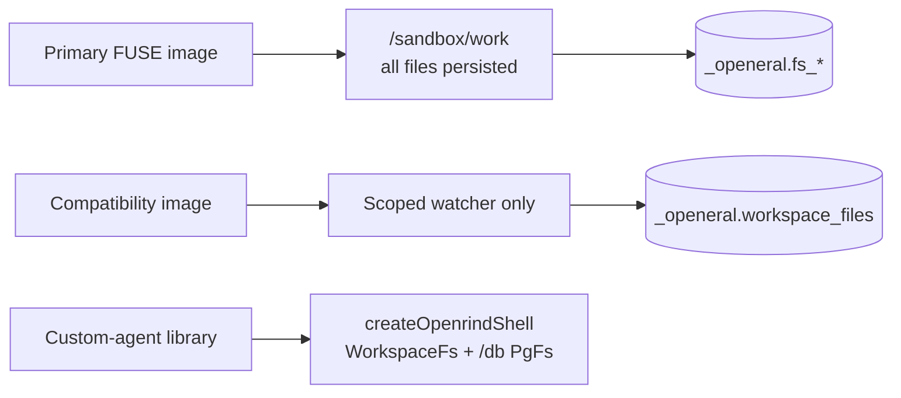

# CLAUDE.md

## Response Style

Use a relaxed ASD-STE100 style in replies and progress updates. Follow the main
writing principles. Strict compliance is not required.

- Use short sentences. Give each sentence one main idea.
- Prefer active voice and common words.
- Use consistent technical terms. Explain unfamiliar terms when needed.
- Avoid idioms, metaphors, filler, and unnecessary jargon.
- Do not change code, commands, paths, identifiers, or quoted text to fit this style.
- State facts, assumptions, uncertainty, and test limits clearly.
- Keep answers concise without losing necessary technical detail.

## Documentation Layout

- `README.md` is the end-user OpenShell flow. Keep package-manager commands out.
- `BUILD.md` is the contributor build, test, and local-gateway guide.
- `ARCHITECTURE.md` describes the implemented runtime split and security boundary.
- `FUSE.md` records alternatives and source research.
- `FUSE-DESIGN.md` is the detailed FUSE correctness contract.

## First-Time Setup

Read README's **Start Here** before running setup. Choose the requested path:

- Customer Claude launch: `openrind-shell` skill; Windows 11 Desktop, matched WSL
  assets, PostgreSQL, and the required Haloop route. Desktop starts Claude.
- Browser validation on Linux: `openrind-dev` skill and BUILD's **Real Linux
  Browser Test**. Use its isolated fixture; no database or provider keys needed.
- OTLP capture validation: `openrind-capture` skill and BUILD's **OTLP Capture
  Library Tests**. This is a standalone host test, not customer activation.
- Browser CTF development: `openrind-ctf` skill and the CTF runtime package.
  Use its deterministic service tests before a model-backed OpenShell evaluation.
- Actual Argide validation: complete the public browser setup, then use
  `openrind-dev` and BUILD's **Actual Argide Application Test**. The private kit
  is required. Only the optional widget/model test needs a funded Gemini key.
- Web task in an already enabled owner: `openrind-browser` skill. Do not treat
  that skill as a host installer or a way to enable a normal Desktop sandbox.

`AGENTS.md` points to this file. `.agents/skills` and `.codex/skills` point to
`.claude/skills`. Keep one canonical copy. If a checkout does not preserve links,
read these canonical files directly instead of overwriting user configuration.

State the operating system, Docker context, selected runtime, and missing
prerequisites before setup. Desktop does not import repository `.env` files.
Never infer successful activation from an installed executable or a unit test.

Public names use **Openrind Shell** and `openrind-shell`. Historical source paths,
Cargo package names, legacy aliases, and the `_openeral` PostgreSQL schema remain
until an explicit compatibility migration exists.

## Runtime Split



- Primary FUSE requires external PostgreSQL and the patched OpenShell Docker driver.
- Compatibility supports optional PostgreSQL or sandbox-lifetime PGlite.
- `sync.ts` is compatibility-only. Never watch or mirror `/sandbox/work`.
- Claude uses native bash in both images. `/db` is custom-agent-only.
- Claude's primary HOME is `/sandbox/claude-home` on a named volume. Project files
  use `/sandbox/work` on FUSE. Browser pods receive neither mount.

## Browser Runtime

- `BROWSER-PODS.md` defines the provider-compatible target. The current package
  status is in `openrind-desktop/packages/browser-pods/README.md`.
- The initial path uses agent-browser v0.38.2's built-in Kernel provider against
  our Kernel-compatible broker. It is API emulation, not the Kernel cloud.
  Real Chromium runs in a separate sandbox. No browser belongs in the owner.
- The launcher supplies `KERNEL_ENDPOINT=http://127.0.0.1:19300` and a non-secret
  compatibility key. Real broker credentials use native provider injection.
  OpenShell clears Docker ENV for exec/SSH; do not rely on it for client setup.
- The real Linux Kernel fixture passed 17 checks. Its configured Hyperbrowser
  SDK extension passed all 26 combined checks. Normal Desktop browser
  activation remains disabled pending Desktop/Claude/FUSE and load tests. Unit and fake-CDP
  results alone do not prove client compatibility. The configured Hyperbrowser
  SDK path has explicit pod-side uploads and ZIP archives. Its contract fixture
  is not extracted Argide code. A separate actual-module test passed 23 checks
  with the supplied kit and one `baseUrl` change. The real backend/widget test
  passed 28 combined checks with Gemini on a controlled form. See BUILD's
  **Actual Argide Application Test**. Do not extend this claim to Auth0,
  general websites, the full app, or Desktop/FUSE integration.
- Kernel and Hyperbrowser share one broker, session core, and pod runtime.
  Argide's optional backend runs in host Docker; its model traffic is outside
  OpenShell and Haloop. Its widget runs in the browser pod through the normal
  website policy. Keep this test separate from the customer Claude launch.
- Stage 0 requires a trusted single-user host. Native CLI forwards expose
  unauthenticated host-loopback CDP ports. Direct gRPC forwarding remains a release gate.
- Use existing native exec, provider injection, and ForwardTcp. Browser pods
  need no additional OpenShell patch or custom TLS terminator. Never replace
  this path with local Chromium, public CDP, or vendor-domain interception.
- Preserve Control Chrome and user MCP configuration. Do not bump the FUSE contract
  or replace an active owner to retire the old managed MCP dependency.
- The regular CTF `--ctf` run uses a non-FUSE owner. `--ctf-fuse` runs both real
  browser tasks in a disposable primary FUSE owner, then checks the trajectory
  and both event files after flush and owner recreation. This is a developer
  persistence test, not Desktop activation or Haloop capture. Use BUILD's
  **FUSE-Backed Browser CTF Test** and require its live evidence before claiming
  the path passed.

## Capture Runtime

- `openrind-desktop/packages/capture` exports OTLP/HTTP protobuf. Desktop requests
  managed routes for content-free lifecycle spans and sampled FUSE health. Full content,
  browser, and model evidence capture is not wired.
- The supplied Haloop release has no `/diagnostics/route` or OTLP receiver.
  Its HTTP 404/501 maps to `receiver_unsupported`; control-path failures map
  to `route_unavailable`. Do not claim a working customer pipeline.
  No valid route means no SDK load or polling. No new WSL service is needed.
- `OPENRIND_DIAGNOSTICS_OTLP_ENDPOINT` is a standalone developer-library setting,
  not Desktop activation. Managed credentials stay in host memory, per sandbox.
- Desktop builds a lazy exporter bundle. Test the isolated ASAR and Electron's
  Node 22.16 runtime. Neither test proves full packaged Windows startup.
- Existing required Haloop inference routing is unchanged. Its private JSON
  ingestion endpoint is not proof of an OTLP receiver.
- Queues are bounded and memory-only. Receiver acceptance does not prove durable
  storage. `persistentAcceptance` remains `unverified` after flush and shutdown.
- Keep project durability, model success, and capture health separate. FUSE
  `flush-all` does not flush telemetry. Do not add a watcher on `/sandbox/work`.
- FUSE counters are approximate and process-local. The health socket is same-UID
  writable. Its output is a diagnostic sample, not trusted execution evidence.
- Use the package README for implemented APIs and the capture specification for
  target behavior. Do not report either capture profile as complete.

## Build And Test

```bash
cd openeral-js
pnpm install
pnpm check

cd ..
cargo fmt --all --check
cargo test -p openeral-fused
cargo clippy -p openeral-fused --all-targets -- -D warnings

cd vendor/openshell
cargo fmt --all --check
cargo check -p openshell-cli -p openshell-driver-docker \
  -p openshell-policy -p openshell-supervisor-process
```

Docker and live tests:

```bash
docker build --pull=false -f Dockerfile.openrind-shell -t openrind-shell-fuse:local .
docker build --pull=false -f Dockerfile.openrind-shell-compat -t openrind-shell-compat:local .

DATABASE_URL='...' tests/test_sandbox_e2e.sh
DATABASE_URL='...' tests/test_setup_e2e.sh

DATABASE_URL='...' \
OPENSHELL_GATEWAY_ENDPOINT='http://127.0.0.1:18770' \
OPENRIND_SHELL_FUSE_E2E_IMAGE='openrind-shell-fuse:local' \
tests/fuse/test_openshell_e2e.sh
```

Do not rebuild NVIDIA's Community base to solve an image-resolution problem.

## Project Structure

```text
crates/openeral-fused/       primary PostgreSQL FUSE daemon
openeral-js/                 migrations, CLI, compatibility sync, just-bash library
sandboxes/openeral/          image scripts and shared policy
vendor/openshell/            pinned OpenShell FUSE capability patch
tests/fuse/                  POSIX conformance and real OpenShell FUSE E2E
.claude/skills/openrind-*/   repository operating skills
```

## Hard Rules

- Keep the supervisor-owned mount and critical-child lifecycle intact.
- Never give Claude `/dev/fuse`, mount syscalls, mount capability, or daemon choice.
- Never add a direct PostgreSQL dialing or TLS-disable fallback to the FUSE daemon.
- TypeScript owns migrations/import; Rust validates schema and volume state.
- Lease loss is terminal; a fenced process discards dirty state and exits.
- Preserve rename-replace, `O_TRUNC`, fsync, sparse-file, and open-unlinked semantics.
- Keep compatibility sync prefix-scoped and exclude credential/cache paths.
- Do not rename `_openeral` without a tested in-place data migration.
- Never hardcode credentials or print database URLs/provider keys.
- Ignore generated artifacts through `.gitignore`, not selective commit omission.
- Never delete, move, or overwrite user files without explicit permission.

## Commit Style

Use descriptive imperative commit subjects. Do not amend unless explicitly requested.
