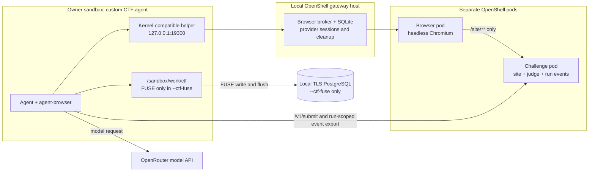
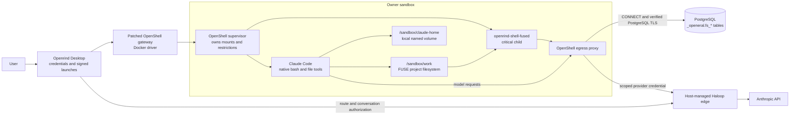
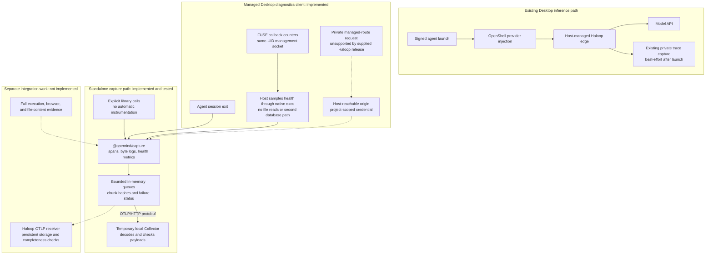
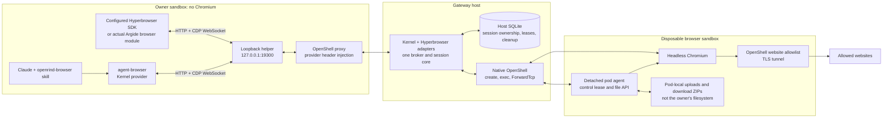
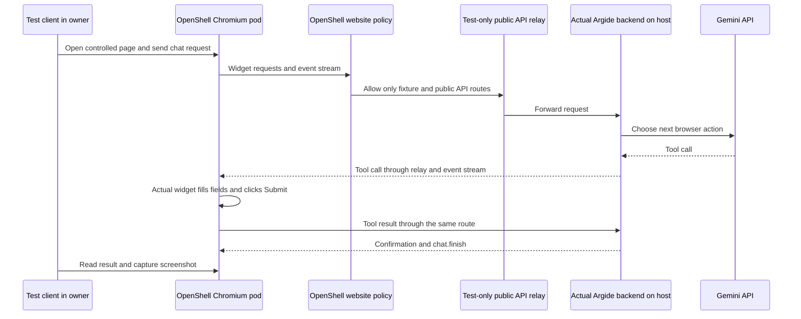

# Openrind Shell

Run Claude Code in an OpenShell sandbox. Store project files in PostgreSQL through
a native filesystem at `/sandbox/work`. Keep Claude's settings and conversation
history in a separate, device-local volume.

An experimental browser service lets agents use real Chromium in a **second
OpenShell sandbox**. One service accepts agent-browser's Kernel API and a
configured Hyperbrowser SDK, including the supplied Argide browser module.
These are API-compatible adapters, not connections to those vendors' clouds.
There is no browser in the agent sandbox and no browser sidebar.

A capture library sends application telemetry through OpenTelemetry Protocol
(OTLP). Desktop has a managed client for agent-lifecycle and FUSE-health
diagnostics. The supplied Haloop source has no matching route or receiver.
Full content capture and durable Haloop ingestion are not implemented. Desktop's
required Haloop inference route is unchanged.

## Start Here

Choose one path. They have different prerequisites and test coverage.

| Your task | Start here | Current limit |
|---|---|---|
| Use Claude with persistent project files | [Start Claude In Desktop](#start-claude-in-desktop) | The managed OpenShell installer targets Windows 11 and WSL2 |
| Try real browser automation without keys | [Try The Browser Runtime](#try-the-browser-runtime) | Linux x64 test; no Desktop, model, database, or vendor account needed |
| Test telemetry or managed runtime diagnostics | [Capture And Haloop](#capture-and-haloop) | Local Collector test; Haloop receiver dependency remains |
| Develop or evaluate browser CTF tasks | [Run Browser CTF Tasks](#run-browser-ctf-tasks) | Linux x64 and local Docker; a model run needs an OpenRouter key; FUSE mode also needs `/dev/fuse` and local TLS PostgreSQL |
| Run the supplied Argide application test | [Run Argide](#run-argide) | Needs the private kit; the widget/model test also needs a funded Gemini key |
| Run a web task in an owner that an operator already enabled | [Use An Enabled Owner](#use-an-enabled-owner) | Browser activation is separate from ordinary Desktop setup |
| Build Desktop, images, or the gateway | [BUILD.md](./BUILD.md) | Source builds need build tools and matched runtime assets |
| Use optional PostgreSQL or embedded PGlite | [Other Runtimes](#other-runtimes) | Compatibility mode does not persist arbitrary project files |

**Browser activation is not part of normal Desktop setup yet.** The Linux browser
test passes, but the full Desktop/Claude/FUSE browser flow and concurrent-load
tests remain release requirements. Do not treat this branch as a finished browser
product. [Current implementation status](./openrind-desktop/packages/browser-pods/README.md)
lists what works and what remains.

If you use Codex to set up this repository, start with
[Instructions For Codex](#instructions-for-codex).

### What Is Included

This checkout contains the runtime source, image recipes, tests, and skills. It
is not a preconfigured Desktop installation. It does not contain the private
Argide kit or real credentials. Browser test images must be built from this
checkout in the same local Docker daemon used by the test gateway.

For a first public-checkout trial, use the key-free Linux browser test. For
Argide, complete that setup first, then load the supplied kit. Keep all host
build and test commands in the linked [BUILD.md](./BUILD.md) guide. Do not run
host setup commands inside an agent sandbox.

An **owner** is the sandbox running the agent or test client. A **browser pod**
is a separate OpenShell sandbox running Chromium. It does not require Kubernetes.
The **broker** is our host service that creates pods and controls their lifetime.
The **helper** is the owner's local connection to that broker.

### Which Components Do You Need?

These are separate paths. You do not need to install every component to try one.

| Path | Components you run | Success means |
|---|---|---|
| Primary Desktop | Desktop, matched OpenShell assets, FUSE, PostgreSQL, and Haloop | Signed Claude launch and a verified project-file flush |
| Browser fixture | Local gateway, broker, helper, owner, and Chromium pod | Real browser actions and cleanup pass the fixture |
| Browser CTF | CTF agent, browser pod, two challenge pods, and an OpenRouter key | Both judges accept; FUSE mode also verifies files after owner recreation |
| Capture fixture | Node.js library and a temporary OpenTelemetry Collector | Standard telemetry arrives intact; no Haloop storage claim |

The capture library is not a new daemon or a replacement for Haloop. Desktop
requests a managed route for content-free diagnostics, but the supplied Haloop
source has no route or OTLP receiver. The browser fixture does not install the
customer Desktop runtime. Keep those test results separate.

## Run Browser CTF Tasks

The experimental CTF runtime has two self-contained challenge services. They
run in separate OpenShell challenge sandboxes. A custom Openrind agent uses the
unchanged `agent-browser` Kernel provider to drive Chromium in a browser pod.
It records model requests, model actions, tool observations, and a separate flag
judge result. These are complete, runnable task fixtures in this repository.
They are independent implementations based on the named challenge families;
they are not copies of the full upstream benchmark repositories. The runtime
does not run Cyber-Zero, EnIGMA, Docker-in-Docker, or a simulated terminal.

| Task ID | Challenge basis | Required browser work |
|---|---|---|
| `flag-command` | Cybench HTB `Flag Command` | Read same-origin page code and call its hidden command API. |
| `glacier-exchange` | Cybench GLA `GlacierExchange` | Read supplied wallet code and use the guided floating-point precision exploit. |

The task implementations, agent, image recipe, unit tests, and live runner are
in this checkout. A developer does not need a Cyber-Zero checkout, an EnIGMA
image, Compose, or a benchmark archive.

### CTF Runtime Architecture



The owner, browser, and challenge are separate OpenShell sandboxes. The browser
pod can reach the public challenge site at `/site/**`; it cannot reach the judge
or event-export routes. The owner can submit a flag and export only the events
for its run. The judge decides whether the flag is correct. Model requests go
directly to OpenRouter, not through Haloop.

The agent writes a trajectory, agent events, and a run-scoped challenge-event
export under `/sandbox/work/ctf`. In regular `--ctf` mode, that path is an
ordinary container directory. The runner downloads the files before teardown.
In `--ctf-fuse` mode, `/sandbox/work` is the primary PostgreSQL-backed FUSE
filesystem. The runner calls `flush-all`, deletes the temporary owner, recreates
it with the same workspace ID, and compares all six file hashes. This is a
developer persistence test. It is not Desktop activation, customer workspace
validation, Haloop capture, or a general CTF benchmark score.

Start with the package unit test. It verifies both browser sites, the exploit
path, and the independent judges without a model key. Then use the live runner
on Linux x64 with local Docker and `OPENROUTER_API_KEY`. The regular mode uses a
temporary non-FUSE owner. The `--ctf-fuse` mode uses a disposable primary FUSE
owner and a local PostgreSQL fixture to test persistence across owner
delete/recreate. Neither mode uses Desktop or a customer sandbox.

Follow [Openrind CTF Runtime](./openrind-desktop/packages/ctf-runtime/README.md)
for exact commands. Use the `openrind-ctf` skill when Codex runs this path.

A model run is successful only when its trajectory and the separate challenge
judge both show an accepted flag. The fixture never inserts a known flag or
claims a model action that the browser tool did not run. Model quality can cause
a valid runtime test to end with an unaccepted flag. FUSE mode also requires the
local TLS PostgreSQL fixture and `/dev/fuse`. The CTF agent still calls OpenRouter
directly. It has no working Haloop mode or CTF OTLP producer. See the package
guide and `openrind-ctf` skill for setup and evidence limits.

The FUSE-backed fixture passed on Linux x64: both judges accepted, and the
trajectory, agent-event, and per-run challenge-event files for both tasks had
matching hashes after owner recreation. This proves the tested local path only.
It does not prove Desktop integration or Haloop capture.

## Start Claude In Desktop

### What You Need

- Windows 11 with virtualization and WSL2 support. Desktop installs its own
  OpenShell Linux environment and Docker daemon.
- An Openrind Desktop build with this branch's matched OpenShell, FUSE, and Haloop
  assets. If you only have a source checkout, follow
  [Desktop source setup](./BUILD.md#windows-desktop-source-setup) first.
- A PostgreSQL connection URL with TLS and permission to initialize the Openrind
  schema. Use a dedicated database or a database approved for this workspace.
- An Anthropic API key. Desktop keeps this key on the host and routes model
  requests through Haloop, its managed inference service.

For Supabase, use its **PostgreSQL connection string**, not its HTTP API URL or
API key. Use an IPv4-compatible **session-mode pooler on port 5432**. Transaction
pooling on port 6543 is rejected because FUSE requires a stable writer session.
The shipped policy covers Supabase poolers. Other database hosts need an explicit
policy entry; see [custom PostgreSQL hosts](./BUILD.md#custom-postgresql-hosts).

The primary runtime requires this repository's patched OpenShell build. A stock
OpenShell binary cannot replace it. The `:just-bash` image is not the FUSE image.
A configured image tag does not prove that an image exists in your Docker daemon.

### First Launch

1. Open Desktop. In **Settings -> Sandbox**, install the bundled OpenShell stack
   and complete its environment checks.
2. In **Settings -> Environment**, save `DATABASE_URL` and `ANTHROPIC_API_KEY` in
   the sandbox credential fields. A repository `.env` file is not automatically
   imported by Desktop. Do not paste keys into a chat, command argument, or log.
3. Open **Sandboxes -> New sandbox**. Choose **Openrind Shell - Claude Code** and
   give the sandbox a name.
4. Wait for initialization and the Claude terminal. Desktop registers the scoped
   Haloop provider, initializes PostgreSQL, and opens a signed Claude session.
   You do not need to type `claude` in a second shell.
5. Ask Claude to run `openrind-shell-fused health`. Its `state` must be `writable`.
   Then ask it to create a uniquely named test file under `/sandbox/work`, read
   it back, and run `openrind-shell-fused flush-all`.

OpenShell `Ready` means that the sandbox started. It does **not** prove that
PostgreSQL initialization succeeded. Stop and diagnose a failed health check.
Do not switch to local storage or a direct Anthropic route to hide the failure.

### Stop And Return

| Action | What to do |
|---|---|
| End the current Claude process | Enter `/exit` in Claude; its wrapper runs a final FUSE flush |
| Work on something else | Leave the sandbox intact and switch sessions in Desktop |
| Return to a running session | Select the same sandbox in Desktop |
| Start Claude again after exit | Use **Reconnect** on the same sandbox; Desktop supplies a new signed launch |
| Check project persistence | Read the test file in the new session; do not create a second writer for the workspace |
| Delete the sandbox | Use Desktop's delete action after ending work; do not bypass its credential cleanup |

Keep the agent-home volume to retain local conversation history. Reconnecting
does not require a new sandbox. A manual OpenShell shell is for diagnostics;
an unsigned `claude` launch from that shell is not the supported inference path.

## Architecture

The **owner sandbox** runs Claude and its tools. OpenShell controls its process,
filesystem, and network permissions. FUSE is the Linux filesystem interface that
makes PostgreSQL-backed project files available to ordinary tools.



OpenShell mounts FUSE before it applies mount-denying restrictions. Claude does
not receive `/dev/fuse` or mount capability. The initializer runs once over SSH
after the sandbox is Ready; it is not PID 1. The supervisor owns the long-running
FUSE daemon. SSH disconnect does not stop that daemon.

Haloop is required for primary Desktop inference. The upstream Anthropic key
stays in the host registry. OpenShell substitutes the scoped credential at the
approved endpoint. Desktop also supplies a signed conversation context. There is
no direct-provider fallback. Trace capture after startup is best-effort; a model
response does not prove that its trace was saved.

### What Persists

| Path or state | Storage | Survives sandbox replacement? |
|---|---|---|
| `/sandbox/work/**` | PostgreSQL FUSE | Yes, with the same workspace ID and database |
| `/sandbox/claude-home/**` | Per-workspace Docker named volume | Yes on the same Docker daemon if the volume is retained; not restored from PostgreSQL |
| `/tmp` and other container files | Local ephemeral storage | No |
| Browser cookies, pages, profile, and downloads | Separate browser pod | No; a replacement browser starts a new session |
| Broker ownership, leases, and cleanup records | Host SQLite database | Retained for cleanup; this does not restore browser pages |

Only one writable FUSE sandbox can use a workspace at a time. No watcher copies
`/sandbox/work`. Claude's home is not stored in the browser pod.

`fsync` and `flush-all` wait for database commit. Ordinary writes use a bounded
cache and can be lost before a durability barrier. A daemon exit or lease loss
can restart the container and end Claude. Do not delete or reset a live workspace
as a troubleshooting step. [ARCHITECTURE.md](./ARCHITECTURE.md) describes the
failure and durability contracts.

## Capture And Haloop

There are two distinct telemetry paths in this checkout:

- **Existing Desktop path:** Haloop routes model requests and captures traces.
  Launch requires a ready inference route. Capture after launch is best-effort.
- **Managed runtime diagnostics client:** Desktop requests a diagnostic route
  from Haloop at agent launch. It can export agent exit intervals and sampled
  FUSE health through OTLP/HTTP protobuf. The supplied Haloop release has no
  matching receiver. Normal launches report diagnostics as unavailable until
  that separate component ships. Inference still works.

OpenTelemetry defines telemetry records and their transport. A **span** records
an operation and its timing. A **log record** carries an observation or payload.
A **metric** measures health or activity. These are separate from the model's
inference API. Neither `/v1/messages` nor `/v1/chat/completions` is an OTLP endpoint.



Solid arrows show implemented paths. Dotted arrows show planned integration.
The Collector test uses synthetic health samples. Windows Desktop and a real
PostgreSQL-backed mount have not yet been tested together with this exporter.
The target gives Haloop ownership of model-call records. Application producers
will report execution evidence. That split must not create a second copy of each
model call. Haloop will own retention, data selection, and export formats.

### Try Capture Without Keys

Use [BUILD.md: OTLP Capture Library Tests](./BUILD.md#otlp-capture-library-tests)
on the host. It lists the exact versions, dependency setup, commands, and expected
output. You need Node.js 22.19 or later and pnpm 10.27.0. The real-collector test
also needs a local Linux host or WSL shell and a local Linux Docker daemon.
No model key, PostgreSQL, browser, private Haloop source, or OpenShell build is needed.

The test starts a digest-pinned Collector, sends all three signals, and rebuilds
a 17 MiB payload from its decoded log records. It checks hashes and trace context.
It removes its own container and temporary files. Success requires exit code 0
and the printed `result: "passed"`; this does not start a persistent service.

### Managed Runtime Diagnostics

Desktop discovers the route through its existing private Haloop control path.
The route must supply an OTLP/HTTP origin reachable from the Desktop host and a
separate project-scoped credential. This needs no new WSL service, public port,
or custom TLS terminator. It does need a matching Haloop receiver release.
See the [managed route contract](./openrind-desktop/packages/capture/README.md#managed-route-contract).

The supplied Haloop source has no matching route. When the endpoint returns
HTTP 404 or 501, Desktop reports `receiver_unsupported`. A control-path failure
reports `route_unavailable`. Do not point Desktop at an inference URL or add an
environment variable to hide these states. The standalone library still accepts
developer endpoint settings; Desktop does not use them.
Discovery and export failures do not stop Claude or change FUSE writes.

With a valid route, Desktop loads its bundled exporter and starts one health
poll per sandbox. Concurrent sessions share that poll. It runs immediately and
every 30 seconds. The last session exit stops it. Re-attaching to a session
releases the extra watch. Agent completion, crash, or cancellation emits a
lifecycle span. With no valid route, the SDK stays unloaded and no polls run.

The rebuilt FUSE daemon exposes callback counts, error counts, and total callback
time in `openrind-shell-fused health`. Counts reset when the daemon restarts.
They include only implemented FUSE callbacks, not every syscall or committed
file version. Older images still report health but have no counters. Do not
replace a live sandbox just to install diagnostics.

Diagnostic spans contain no file paths, contents, commands, model messages, or
database URLs. Health comes from a same-UID socket and is not trusted execution
evidence. The existing Haloop runtime status response includes a separate
`runtimeDiagnostics` result; it does not replace existing trace-capture status.
Its `ready` phase means the producer initialized. It does not prove delivery.
Full Windows app startup and live FUSE-to-Haloop delivery remain release gates.

### Read Capture Results Correctly

| Result | What it proves |
|---|---|
| `accepted: true` from a record call | The library admitted that record into its local queue |
| OTLP receiver acceptance | The receiver accepted an export batch, not necessarily durable storage |
| `localStatus: "pending"` | No known local evidence loss; not capture completion |
| `localStatus: "degraded"` | Evidence was rejected or an evidence export failed; inspect the status counters |
| `persistentAcceptance: "unverified"` | Expected today, including after a successful `flush()` or `shutdown()` |

Queues exist only in process memory. Failed exports remain visible in status,
but this library cannot recover them after exit. Metrics have separate failure
counters. FUSE `flush-all` commits project files; it does not flush telemetry.
Likewise, a telemetry flush does not commit project files.

Full browser/FUSE evidence, producer credentials for that evidence, durable
ingestion, and capture completeness are still missing. Diagnostic activation
does not enable those features. Do not point the library at Haloop's existing private JSON ingestion
endpoint and assume it accepts OTLP. See the
[package API and limits](./openrind-desktop/packages/capture/README.md) for working
interfaces, and the [capture specification](./w8-haloop-openshell-fuse-integration-plan.md)
for the target contract. The specification is not a list of shipped features.

## Browser Support

Browser pods use provider APIs, not the retired managed MCP browser service.
Both adapters use the same broker, session records, owner checks, transport,
browser image, and cleanup rules. The browser actions are real, not canned
responses. CDP (Chrome DevTools Protocol) carries browser commands and results.

| Client | Adapter and configuration | Session behavior |
|---|---|---|
| agent-browser `0.38.2` | Built-in `kernel` provider; the installed launcher supplies our local endpoint | Reuses its browser across commands; a failed health probe can cause a new browser |
| Hyperbrowser SDK `0.91.0` | Set the SDK's `baseUrl` to our local helper before launch | Can disconnect and reconnect to the same live browser within its lease |
| Supplied Argide browser module | The same Hyperbrowser adapter; one constructor configuration change | Tested with its real create, initialize, get, upload, and stop functions |



In a provisioned owner, the installed launcher supplies `AGENT_BROWSER_PROVIDER=kernel` and
`KERNEL_ENDPOINT=http://127.0.0.1:19300`. It supplies a non-secret compatibility
value for `KERNEL_API_KEY`; this is not the broker credential. The real broker
credential remains in host configuration and OpenShell's provider store.
The helper address is inside the owner, not a host browser page. A client must
not call the broker's private bridge address directly. OpenShell exec does not
inherit image environment settings; the launcher supplies its defaults on each call.
Do not supply a local Chrome executable, `--cdp`, or vendor credentials.
No vendor-domain interception or client fork is used.

The Hyperbrowser path needs its own host-approved provider grant and SDK setup.
It does not change agent-browser's selected provider. The Argide compatibility
profile reports unsupported features, such as recording and stealth, as explicit
no-ops. It does not provide full Hyperbrowser parity, a viewer, or CAPTCHA solving.

Browser pods add **no OpenShell source patch** beyond the existing FUSE fork.
They use native provider injection, exec, and ForwardTcp. The broker, helper,
session rules, and API adapters are Openrind code. A running broker and a
provisioned owner are required; an installed client alone cannot create this setup.

Chromium runs with `--no-sandbox` in the tested pod; OpenShell supplies the outer
isolation boundary. The host operator must accept that setting. Website access
is allowlist-only. OpenShell tunnels website TLS without HTTP content inspection.
CDP grants control of the assigned browser, including JavaScript and cookies.
An allowed website can receive data the agent sends; this is not data-loss
prevention or per-action approval enforcement. The current test transport also
opens unauthenticated CDP listeners on host loopback. Use a trusted single-user
host. Direct in-process forwarding remains a release requirement.

### Availability

| Capability | State in this checkout |
|---|---|
| Kernel API, helper, broker, real Chromium in OpenShell | Passed the Linux live fixture |
| Navigation, snapshot, click/fill, screenshot, session reuse | Passed with the unchanged agent-browser binary |
| Destination denial, client file-action denial, crash replacement, cleanup | Passed the Linux live fixture |
| Browser-enabled Desktop/Claude session and FUSE screenshot persistence | Not yet verified; normal activation remains disabled |
| Configured Hyperbrowser SDK | Passed the separate Linux SDK test; create/get/list/stop and retained-session support |
| Browser-side uploads and ZIP download archives | Explicit Hyperbrowser SDK APIs; no local path translation or automatic FUSE export |
| Actual Argide browser module | Passed with the supplied image and one Hyperbrowser `baseUrl` change |
| Actual Argide backend and widget | Passed one model-driven form task in OpenShell Chromium; not the Auth0 dashboard or Desktop integration |
| Browserbase, Browser Use, or Browserless adapters | Not implemented |
| Control Chrome and user MCP connections | Separate existing options; not changed or validated by the pod test |
| Sidebar, VNC viewer, personal Chrome profile | Not part of the pod design |

### Try The Browser Runtime

From a Linux x64 checkout, follow
[BUILD.md: Real Linux Browser Test](./BUILD.md#real-linux-browser-test). That
section includes prerequisites, dependency setup, native builds, both image
builds, and the test command. You do not need PostgreSQL, an Anthropic key, a
Kernel account, or a running Desktop app for this test.

The fixture creates a private gateway, a browser-only owner, and real browser
pods. It tests the Kernel API and native OpenShell transport, then removes its
containers and network. It prints a private evidence directory containing
`evidence.json` and `page.png`. Success requires exit code 0, `result: "passed"`,
all 17 checks, and no cleanup error. This does not leave a customer sandbox open.

The test passed on 2026-10-06 with Chromium 154.0.8037.92 and agent-browser
v0.38.2 on Linux x64. It also passed a delayed-lease test and 17 MiB CDP tests in
both directions through the real proxy. It does not establish Windows Desktop support, Argide
compatibility, FUSE persistence, or performance under concurrent load.

The [Hyperbrowser SDK test](./BUILD.md#hyperbrowser-sdk-test) extends the same
setup. It uses SDK `0.91.0` and Playwright `1.59.1` in the owner. Its 26 combined
checks passed on 2026-10-06. They include a 61-second reconnect, multipart upload,
and download ZIP verification. It needs no account or model key. This is an SDK
test, not the actual Argide application.

## Run Argide

Argide is optional test input, not part of the shipped Openrind runtime. The
private kit contains a backend image, a widget bundle, and database seed data.
Without that kit, run the public Kernel or Hyperbrowser SDK test instead.

Start with [BUILD.md: Actual Argide Application Test](./BUILD.md#actual-argide-application-test).
Its linked guide has the exact archive hashes, extraction, image build, startup,
seed, test, and stop commands. Run those commands on the **Linux host**, from
the repository root. Do not install the kit into a customer's persistent owner.

| Path | Additional requirements | Expected result |
|---|---|---|
| Actual browser module | Private kit and a derived test owner image; no real keys | 23 combined checks; `argide.json` records source hashes and the one `baseUrl` change |
| Real backend + widget + model | The same kit, Docker Compose, and an exported, funded `GEMINI_API_KEY` | 28 combined checks; `argide-widget.json` records tool calls; `argide-widget.png` shows the submitted form |

The model test adds this path to the browser architecture above:



The actual backend runs in **host Docker**, with its own MongoDB, Redis, and
Qdrant services. Its model requests go directly to Gemini, not through OpenShell
or the Desktop Haloop route. Chromium and the actual widget run inside the
browser pod. The widget's website/API traffic does pass through OpenShell.
The backend API binds to host loopback; the fixture exposes only its public API
routes on the isolated test bridge. No public tunnel is required.

The 28-check run passed on 2026-10-06. The harness entered the chat request and
approved actions only on the controlled test page. Argide chose and executed the
form actions. The module's constructor uses our endpoint; the backend image and
widget remain unchanged. This is not an unchanged whole-application claim.

Expect one controlled browser task, not a persistent web application or dashboard.
The test closes its browser and removes its OpenShell resources. Follow the guide's
separate Compose shutdown step to stop the backend and background model work.
The evidence directory contains private test credentials; do not publish it whole.

The Auth0 dashboard, real website login, knowledge-base retrieval, recordings,
general site compatibility, and Desktop/Claude/FUSE integration are not verified.
The kit's optional OpenAI calls use placeholders in this Gemini test and can log
errors. They are not evidence of a working knowledge base. Normal Desktop browser
activation remains disabled.

## Use An Enabled Owner

This section applies only after a host operator completes
[Owner Activation](./BUILD.md#owner-activation). The environment flag alone is
not activation. The broker, image, owner grant, provider, policy, and trusted
helper configuration must already exist.

Inside that owner, use the bundled `openrind-browser` skill. It checks the client
and helper, uses a distinct `--session` name for each task, and closes that
session afterward. Screenshots return bytes to the owner and can be written to
`/sandbox/work`. Website download paths belong to the browser pod, not the owner.
Do not claim that a website file was exported to FUSE.

A failed three-second browser health probe can cause agent-browser to delete the
old session and create a new one. Page state is lost. Inspect the current page
before you continue. Never repeat a purchase or submission just because a
connection failed.

## Instructions For Codex

Open this checkout in Codex before asking it to run the product. The repository
shares one set of instructions and skills:

```text
AGENTS.md       -> CLAUDE.md
.agents/skills  -> ../.claude/skills
.codex/skills   -> ../.claude/skills
```

Keep these links. If a ZIP or Windows checkout turns them into text files, ask
the tool to read `CLAUDE.md` and the canonical `.claude/skills/` files directly.
Do not overwrite an existing local skill directory to repair discovery.

| Skill | Use it for |
|---|---|
| `openrind-shell` | Desktop setup, signed Claude launches, and FUSE diagnostics |
| `openrind-dev` | Source builds, host browser setup, Linux browser tests, and the private Argide fixture |
| `openrind-capture` | OTLP tests, host runtime diagnostics, and telemetry failure diagnosis |
| `openrind-ctf` | Self-contained browser CTF service tests and model-agent evaluation |
| `openrind-browser` | Browser commands inside an already enabled owner sandbox |
| `openrind-navigate` | Filesystem boundaries, SQL queries, and persistence checks |

For a first browser test, give Codex this task:

> Read AGENTS.md, README.md, the openrind-dev skill, and BUILD.md's Real Linux
> Browser Test. Check the prerequisites. Run that isolated test without changing
> my existing sandboxes or reading provider keys. Report its exit code, all test
> results, the evidence path, cleanup status, and anything you could not test.
> Do not treat a unit test or a fake browser as a real Chromium result.

For the actual Argide model test, give Codex this task and the private archive path:

> Read AGENTS.md, README.md's Run Argide section, the openrind-dev skill, and
> BUILD.md's Actual Argide Application Test. Check the Linux/Docker prerequisites
> and the supplied kit hashes. Run the actual module and widget/model test with
> the configured Gemini key. Do not print keys or change existing sandboxes.
> Report the 28-check result, real tool calls, screenshot path, source change,
> and cleanup. Stop the temporary backend afterward. Do not replace the actual
> Argide code with an SDK mock or claim Desktop/FUSE support from this test.

For the FUSE-backed CTF persistence test, give Codex this task:

> Read AGENTS.md, README.md's Run Browser CTF Tasks section, the openrind-ctf
> skill, and BUILD.md's FUSE-Backed Browser CTF Test. Check Linux x64, Docker
> context and server, the matched OpenShell binaries, `/dev/fuse`, local TLS
> PostgreSQL setup, images, required ports, and `OPENROUTER_API_KEY` before
> setup. Run the service tests first. Then run `--ctf-fuse` only in its
> disposable fixture. Do not use or replace a customer sandbox. Do not print or
> copy credentials, and do not load an unrelated repository `.env` file. Report
> both judge results, all live checks, the six before/after hashes, evidence
> path, cleanup status, and every blocked step. Do not call this Haloop capture
> or a Desktop test.

For a Desktop launch, use `openrind-shell` instead. Ask the tool to report missing
Windows runtime assets or credentials before it tries a different launch path.
Do not let it infer that a repository `.env` file has populated Desktop settings.

For the capture library, give Codex this task:

> Read AGENTS.md, README.md's Capture And Haloop section, the openrind-capture
> skill, and BUILD.md's OTLP Capture Library Tests. Check Node, pnpm, local Docker,
> and socket access. Run the unit tests and the real Collector test without loading
> keys or changing my sandboxes. Report test counts, the Collector receipt, cleanup,
> and blocked steps. Do not claim Haloop persistence or complete capture from this test.

## Troubleshooting

| Symptom | Check or next action |
|---|---|
| `--fuse` is unknown | Use the paired vendored CLI, gateway, and supervisor; not a stock CLI on `PATH` |
| Desktop cannot find an image | Source builds use the dedicated WSL Docker daemon; images in Docker Desktop alone are insufficient |
| NVIDIA base image cannot be pulled | Check the exact image name, Docker context, registry access, and error. Do not rebuild NVIDIA's base |
| Sandbox is Ready but FUSE is not writable | Inspect `openrind-shell-fused health`; check database TLS, host policy, workspace ID, and initialization error |
| PostgreSQL reports another active writer | Find the existing workspace sandbox. Do not start a second mount or delete the first without approval |
| Supabase URL uses port 6543 | Select the session-mode pooler URL on port 5432 |
| Direct `claude` fails from a diagnostic shell | Start or reconnect through Desktop for the signed Haloop context |
| `agent-browser` is missing | The existing owner image lacks the new assets; rebuilding an image does not update a running container |
| Browser helper is not ready | Host activation is missing or stopped. Use the host guide; do not install Chrome in the owner |
| `CLIENT_PROFILE_CONFLICT` | Remove only the conflicting browser override for this task; use the managed Kernel path |
| Browser navigation is denied | The destination is outside the host's website allowlist. Request operator review; do not broaden it automatically |
| Browser live test is slow or blocked | Follow the build and diagnosis steps in BUILD.md; preserve the exact error and report the failed stage |
| Argide archive is missing or its hash changed | Ask for the matching kit or review the new version. Do not silently substitute the SDK fixture |
| Argide backend is ready but no model result arrives | Confirm a funded Gemini key and the public product seed. Read private backend errors; readiness does not test model access |
| Argide widget cannot reach its API | Use the fixture's initial website policy and relay. Do not hot-update a live pod or open all host ports |
| Capture status stays `pending` after export | Expected; the library has no durable-completion protocol |
| Capture status is `degraded` | Check rejected, partial, and failed evidence counters; a later successful batch does not erase loss |
| Collector test passes but Desktop has no new telemetry | Configure the host diagnostic endpoint and start a new agent session; full content capture is not implemented |
| Capture endpoint validation fails | Supply the receiver's HTTP(S) origin, not an inference URL or a `/v1/traces` path |

Delete Desktop-owned sandboxes through Desktop so it can close agents and revoke
scoped credentials. A WSL reset also deletes device-local home volumes and traces;
PostgreSQL project data is separate. Never use reset as an automatic repair.

## Other Runtimes

The compatibility image (`Dockerfile.openrind-shell-compat`, publication target
`:just-bash`) uses native bash plus a scoped watcher. With external PostgreSQL it
persists `.claude`, `.claude.json`, `.openrind-shell`, and legacy `.openeral` state.
Other files stay local. With PGlite, even the database lasts only for that sandbox.
It is an explicit alternative, not a fallback for failed primary initialization.

The custom-agent library uses just-bash with `WorkspaceFs` and a read-only `/db`
virtual filesystem. Claude does not use that library shell in either image.
See [BUILD.md](./BUILD.md#compatibility-and-library-tests) for these developer paths.

Public names use Openrind Shell. Historical source paths and the `_openeral`
schema remain for compatibility. Do not rename stored tables to match branding.

## More Detail

- [BUILD.md](./BUILD.md): source setup, image builds, test commands, and host provisioning.
- [ARCHITECTURE.md](./ARCHITECTURE.md): implemented lifecycle, security, and durability.
- [Capture library status](./openrind-desktop/packages/capture/README.md): OTLP APIs, managed route contract, and remaining capture limits.
- [Browser package status](./openrind-desktop/packages/browser-pods/README.md): test evidence and remaining release requirements.
- [BROWSER-PODS.md](./BROWSER-PODS.md): target design; not a list of shipped capabilities.
- [Desktop integration](./openrind-desktop/apps/desktop/OPENRIND_SHELL.md): managed gateway, Haloop, and terminal details.
- [FUSE-DESIGN.md](./FUSE-DESIGN.md) and [FUSE.md](./FUSE.md): correctness contract and research history.
