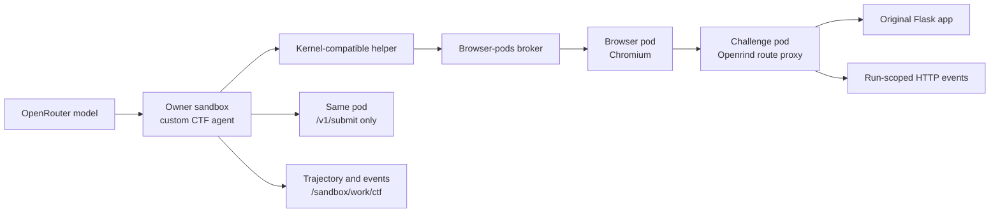

# Openrind CTF Runtime

This package runs two real browser challenges from the Cybench benchmark. Each
OpenShell challenge sandbox runs the task's original Flask application and
assets. Openrind adds a narrow HTTP proxy, run-scoped event log, and separate
flag judge. These are not locally recreated challenge pages.

## Included Tasks

| Task ID | Upstream challenge | App entry point | Browser routes |
|---|---|---|---|
| `flag-command` | HTB `Flag Command` | `challenge/run.py` | `/`, `/static/**`, `/api/options`, `/api/monitor` |
| `glacier-exchange` | GLA `GlacierXchange` | `chall/server.py` | `/`, `/assets/**`, the task's public `/api/**` routes |

The task code and assets are under `sandboxes/ctf-challenge/tasks/`. They come
from `amazon-science/Cyber-Zero`, commit
`e0c4493ac27dd3a8c96e524c3966c3927261c625`, in these directories:

- `benchmarks/cybench/HTB/web/[Very Easy] Flag Command/`
- `benchmarks/cybench/GLA/web/GlacierExchange/`

Only each runnable app, its required assets, and its task flag are included.
Cyber-Zero's agent, simulator, EnIGMA code, solution folders, writeups, and
benchmark metadata are not included. Each image contains one task and one flag.

The source repository uses CC BY-NC 4.0. Challenge files can also have rights
from their original creators. The license text and source record are included
with the task files. Review those rights before commercial use or redistribution.

## Runtime Design



The browser opens the actual app at `/`. The proxy forwards the request path,
method, headers, and body to the original Flask process. It does not implement
the task routes. The browser policy allows only the routes listed above. It
does not allow `/v1/**`.

The owner can call `POST /v1/submit` and `GET /v1/events?run=<run-id>` with the
judge token. The challenge image reads the expected flag from its own
`/flag.txt`. It does not send the flag to the owner before a successful
submission. The agent exports only challenge events that the server recorded
under the current run ID.

The custom agent uses the unchanged `agent-browser` Kernel provider. It records
model requests and failures, browser actions, observations, and judge results.
Model requests go directly to OpenRouter in this developer test. The CTF agent
does not use Haloop and does not emit OTLP evidence.

## Tests

Run the local Node tests from the repository root:

```bash
node --test openrind-desktop/packages/ctf-runtime/test/*.test.mjs
```

These tests cover task definitions, the proxy contract, run attribution, and
judge isolation. The proxy test uses a local HTTP server. It does not execute
the Flask apps.

After building both task images, run the actual-app smoke test:

```bash
pnpm --dir openrind-desktop/packages/ctf-runtime test:images
```

It starts each image, solves each original app through its public routes,
checks the independent judge, checks the run-scoped event export, and removes
the test containers. It needs Docker, but it does not need OpenShell, a browser,
or a model key. It is not a model evaluation.

## Live OpenShell Run

Use Linux x64 with Docker. Follow [BUILD.md's Real Linux Browser Test](../../../BUILD.md#real-linux-browser-test)
for host dependencies and matching OpenShell binaries. The test creates a
temporary gateway, an owner, two challenge sandboxes, and a Chromium sandbox.
It does not use a customer Desktop owner.

Build the images from the repository root. Use one image per challenge:

```bash
docker build --pull=false \
  -f openrind-desktop/packages/browser-pods/test/live/Dockerfile.owner \
  -t openrind-browser-owner:e2e .

docker build --pull=false \
  -f sandboxes/browser-pod/Dockerfile \
  --build-arg CHROMIUM_VERSION=154.0.8037.92-1~deb12u1 \
  -t openrind-browser-pod:e2e sandboxes/browser-pod

docker build --pull=false -f sandboxes/ctf-challenge/Dockerfile \
  --build-arg TASK_ID=flag-command -t openrind-ctf-flag-command:e2e .
docker build --pull=false -f sandboxes/ctf-challenge/Dockerfile \
  --build-arg TASK_ID=glacier-exchange -t openrind-ctf-glacier-exchange:e2e .
```

Set `OPENROUTER_API_KEY` through the host environment. The default model is
`openai/gpt-4o-mini`. Set `OPENRIND_CTF_MODEL` to select another
JSON-schema-capable OpenRouter model. Use
`OPENRIND_CTF_REASONING_EFFORT=low` only when the selected model supports that
OpenRouter option.

Run the evaluation:

```bash
node openrind-desktop/packages/browser-pods/test/live/openshell-e2e.mjs --ctf
```

The test checks that each sandbox serves its upstream app page. It then runs the
custom agent in the owner, drives the actual app through the browser pod, and
requires the separate judge to accept the flag. A model can fail to solve a
valid task. Do not insert a flag or replace an agent action to make the run
pass.

The runner writes private evidence to a temporary directory. It includes model
messages, task requests, browser observations, and submissions. Do not publish
the evidence unchanged.

## FUSE Persistence Test

Use `--ctf-fuse` when the requested result includes persistent trajectory and
event files. Follow [BUILD.md's FUSE-Backed Browser CTF Test](../../../BUILD.md#fuse-backed-browser-ctf-test).
That path also needs `/dev/fuse`, a local TLS PostgreSQL fixture, and
`DATABASE_URL`. It creates a disposable primary FUSE owner, runs both tasks,
flushes `/sandbox/work/ctf`, deletes the owner, and recreates it with the same
workspace ID. It then requires matching hashes for each trajectory, agent event
file, and run-scoped challenge event file.

This proves only the tested Linux path. It does not prove Desktop activation,
customer workspace behavior, Haloop capture, or broad Cybench coverage.

## Source Map

```text
sandboxes/ctf-challenge/tasks/  imported runnable benchmark apps and assets
openrind-desktop/packages/ctf-runtime/src/tasks.mjs
  task metadata, app entry points, and browser route allowlists
openrind-desktop/packages/ctf-runtime/src/challenge-server.mjs
  app proxy, judge endpoint, and per-run event records
openrind-desktop/packages/ctf-runtime/src/agent.mjs
  browser agent, model calls, and trajectory writer
openrind-desktop/packages/browser-pods/test/live/openshell-e2e.mjs
  live OpenShell setup and model-backed task evaluation
```
