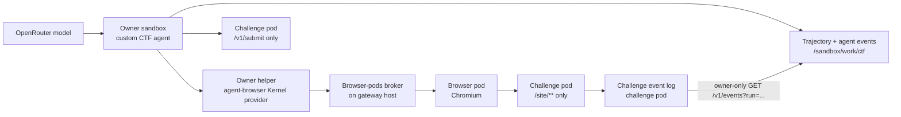

# Openrind CTF Runtime

This package runs two browser CTF tasks with Openrind Shell components. It does
not run Cyber-Zero, EnIGMA, Docker-in-Docker, or a simulated terminal.

The task services preserve the relevant public behavior of these browser tasks:

| Openrind task ID | Source challenge family | Browser interaction |
|---|---|---|
| `flag-command` | Cybench HTB `Flag Command` | Inspect a web terminal and call its same-origin API. |
| `glacier-exchange` | Cybench GLA `GlacierExchange` | Inspect the supplied wallet source and use floating-point precision loss. |

The task services are independent Node.js implementations. A test run does not
need a Cyber-Zero checkout, a benchmark archive, an EnIGMA image, or Compose.
GlacierExchange includes a guided solution hint with the exact same-origin API
sequence. This makes the live test a runtime and capture check, not a measure of
model problem-solving ability.

## Runtime Design



The browser pod can read only `/site/**`. The owner cannot read `/site/**`.
The owner can submit through `POST /v1/submit` and export the bounded event log
for one run through `GET /v1/events?run=<run-id>`. The browser and judge routes
stay separate.

The agent uses the unchanged `agent-browser` Kernel provider. It has only these
browser actions: `snapshot`, `get_title`, and same-origin `eval`. It records
each model request, response or failure, the chosen action, the observed tool
result, and the flag judge result. A `none` action becomes an observation. It
does not stop the run. History has message and character limits.

The owner exports the challenge service's bounded event log after the run. The
export endpoint requires the judge token and a validated run ID. It returns only
events whose server-recorded actor matches that run ID. The agent does not add
or rewrite actor IDs. OpenShell allows the owner to use
`GET /v1/events?run=<run-id>`; the browser pod still receives access only to
`/site/**`.
The agent stores its trajectory, agent events, and exported challenge events
under `/sandbox/work/ctf`. The regular `--ctf` fixture has no FUSE mount. It
downloads these files before teardown, so that mode does not prove persistence.
The `--ctf-fuse` mode runs both challenges inside the primary FUSE owner. It
flushes the files, deletes the owner, creates a replacement with the same
workspace ID, and compares SHA-256 hashes of all three files per challenge.

The live fixture sends model requests directly to OpenRouter. It writes a
temporary key file in the test owner. There is no working CTF Haloop mode. A
config that selects `haloop` fails with
`HALOOP_CTF_PROFILE_NOT_IMPLEMENTED`. The CTF agent is not a managed Desktop
launch profile, and it has no OTLP evidence producer. Do not present its events
or trajectory as Haloop capture. A managed CTF profile must provide an isolated
per-run Haloop context, authorized launcher identity, provider-injected
credential, and OTLP producer before this mode can be enabled.

## Run The Live Test

Use Linux x64 with Docker. Follow the host checks and OpenShell build steps in
[BUILD.md](../../../BUILD.md#real-linux-browser-test) first. This test creates a
new local gateway, owner, two challenge sandboxes, and browser pods. It does not
use an existing Desktop sandbox or PostgreSQL FUSE owner.

Build the test images from the repository root. Do not rebuild NVIDIA's base
image.

```bash
docker build --pull=false \
  -f openrind-desktop/packages/browser-pods/test/live/Dockerfile.owner \
  -t openrind-browser-owner:e2e .

docker build --pull=false \
  -f sandboxes/browser-pod/Dockerfile \
  --build-arg CHROMIUM_VERSION=154.0.8037.92-1~deb12u1 \
  -t openrind-browser-pod:e2e sandboxes/browser-pod

docker build --pull=false \
  -f sandboxes/ctf-challenge/Dockerfile \
  -t openrind-ctf-challenge:e2e .
```

Set `OPENROUTER_API_KEY` in your shell. Use a model that supports JSON-schema
responses. `OPENRIND_CTF_MODEL` changes the default `openai/gpt-4o-mini`.
For a reasoning model that supports OpenRouter's setting, set
`OPENRIND_CTF_REASONING_EFFORT=low` to leave response tokens for the required
JSON action. Do not set this option for a model that does not support it.

```bash
node --env-file=.env \
  openrind-desktop/packages/browser-pods/test/live/openshell-e2e.mjs --ctf
```

The test passes only when both tasks have a browser request from the recorded
agent run and the separate judge accepts each submitted flag. It writes private
evidence to the printed temporary directory:

- `flag-command-trajectory.json`
- `glacier-exchange-trajectory.json`
- agent and challenge event logs for each task
- the normal browser-pod evidence and diagnostics

The evidence contains model messages, challenge events, submissions, and task
data. Do not publish it unchanged.

## Run With A FUSE Owner

Use `--ctf-fuse` to prove that the real CTF agent writes durable files through
the primary PostgreSQL FUSE mount. This mode implies `--ctf`. It needs the local
TLS PostgreSQL fixture, the patched OpenShell gateway build, a primary FUSE
owner image with the local-PostgreSQL CA and policy overlay, the browser-pod and
challenge images, and `OPENROUTER_API_KEY`. It does not use a customer Desktop
owner.

Follow [BUILD.md's FUSE-backed CTF test](../../../BUILD.md#fuse-backed-browser-ctf-test)
to build the images and start the local database fixture. The owner image is a
test-only overlay that adds the trusted helper configuration. Then run:

```bash
CTF_FUSE_OWNER_IMAGE='openrind-shell-fuse-browser-ctf:test' \
node openrind-desktop/packages/browser-pods/test/live/openshell-e2e.mjs --ctf-fuse
```

The test creates a disposable FUSE owner with a unique workspace ID. It keeps
the image's PostgreSQL policy, adds only the CTF model and judge routes, attaches
the browser provider, and probes the installed helper. It runs both tasks with
the real model and browser pod. It then calls `openrind-shell-fused flush-all`,
hashes each trajectory, agent event log, and exported challenge event log,
deletes the owner, and recreates it with the same workspace ID. It downloads
each file from the replacement owner and requires its hash to match.

The host-side challenge event log is separate evidence. The persisted
`*-challenge-events.jsonl` file is the exact per-run export that the agent wrote
to FUSE. The mode still uses direct OpenRouter calls. It does not prove Haloop
capture, Desktop integration, or durability in a customer workspace. If a model
does not solve either task, the test fails before the persistence claim.

## Limits

- This is a developer fixture. It is not an enabled Desktop feature.
- The regular `--ctf` test uses a separate non-FUSE browser-pod owner. Use
  `--ctf-fuse` to run the same challenges in the primary FUSE owner and test
  delete/recreate persistence.
- The model can fail to solve a task. That result is recorded as a failed run.
  The test does not insert a known flag or replace a failed model action.
- The challenge services are test-only. They do not expose an Internet listener.
- The model key is uploaded only to the temporary owner sandbox for the test and
  is removed from the host test state after upload. Do not put the key in source,
  a task definition, or a command argument.
