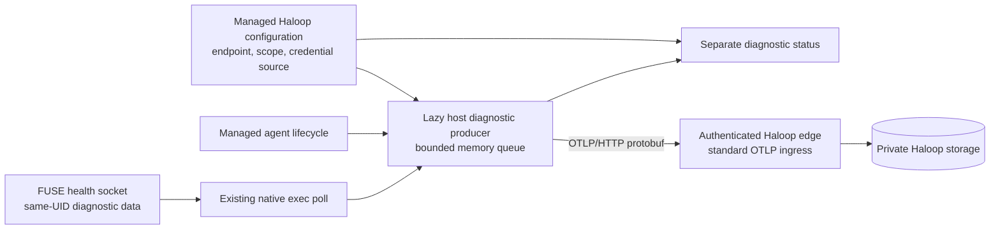
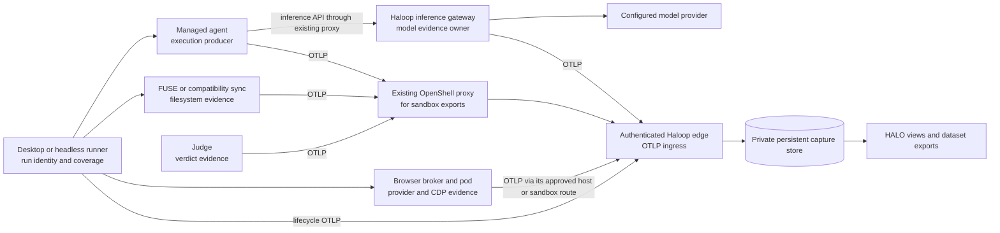
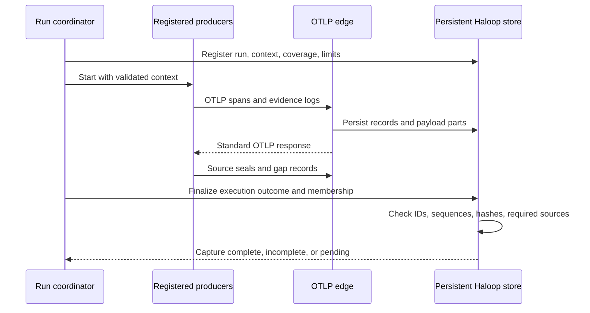
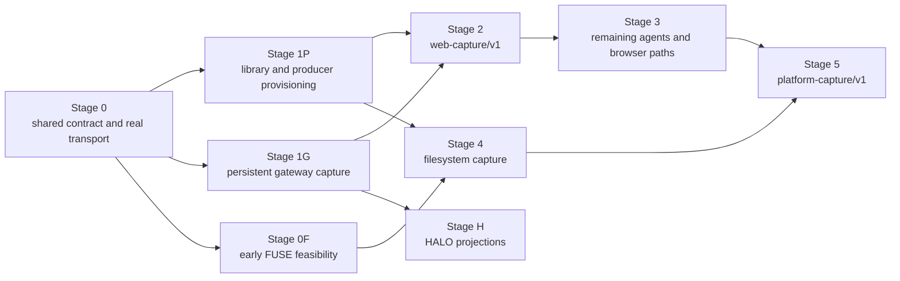

# Openrind Shell and Haloop: Unified OTLP Capture

Status: proposed implementation contract. Updated: 2026-10-09.
Source baseline: Openrind commit `15cc71f`, plus the uncommitted diagnostic
checkpoint reviewed on 2026-10-09; supplied w8-haloop archive dated 2026-09-29.
These references describe the inspected code, not a release approval.

This document replaces the earlier Haloop integration plan and implementation
log. Git history retains that log. This is a target specification. It does not
claim that the current images implement OTLP capture.

The immediate milestone is **managed runtime diagnostics**: agent lifecycle
and sampled FUSE health sent to Haloop during normal Openrind runs. Customers
must not need an endpoint environment variable. Section 2.5 defines this smaller
milestone. The broader capture requirements remain separate target work.

OTLP is platform-neutral. This specification does not require a new WSL service,
a fixed port `4318`, a custom TLS terminator, or an OpenShell patch. The managed
deployment must supply a reachable, authenticated OTLP endpoint.

## 1. Objective and Decisions

Use OpenTelemetry Protocol (OTLP) as the common capture wire for Openrind Shell
and Desktop. The broader target covers all managed agents and their browser and
filesystem runtimes. The immediate diagnostic milestone has the smaller scope
in Section 2.5. Haloop's persistent storage is the system of record.

The inference API remains the API supported by the client and configured model.
Choosing OTLP does not require a switch between Anthropic Messages and OpenAI
Chat Completions. ShareGPT and HALO views are server-side projections of captured
evidence.

| Decision | Requirement |
|---|---|
| Capture wire | Standard OTLP/HTTP protobuf for new Openrind producers |
| Signals | Traces for operations; logs for detailed evidence; metrics for health |
| Agent scope | Claude, OpenClaw, OpenHands, and the existing CTF agent |
| Browser scope | agent-browser Kernel path, Hyperbrowser-compatible path, browser broker and pods |
| Filesystem scope | Primary PostgreSQL FUSE and compatibility sync when used |
| Browser detail | Every CDP message in both directions, with connection lifecycle events |
| Filesystem detail | Every request observed by FUSE, plus consistent committed file versions |
| Model detail | All provider-returned bodies and stream content available at the gateway |
| Dataset capture failure | Stop further scheduled actions after a permanent failure or exhausted retry capacity |
| Interactive capture failure | Continue the session and mark its capture degraded |
| Data selection | Haloop owns retention, redaction, dataset export, and training eligibility |
| Storage guarantee | Persistent acceptance must be established separately from ordinary OTLP acceptance |
| Immediate delivery | Managed lifecycle and FUSE-health diagnostics; not complete content capture |
| Later capture delivery | Release a declared web-capture profile before full-platform capture |

The implementation must use standard SDKs, protobuf definitions, and exporter
behavior. Openrind-specific work supplies instrumentation, evidence attributes,
bounded buffering, and completion checks. Do not build a second telemetry
transport.

## 2. Scope and Responsibilities

### 2.1 Repository Boundary

This repository owns Openrind producers, launch context, provider policy,
browser instrumentation, filesystem instrumentation, and integration tests.

The w8-haloop team owns authenticated OTLP ingress, gateway model capture,
persistent ingestion, evidence reassembly, completeness evaluation, and HALO
adapters. That work is a separate repository dependency. This specification
defines the shared contract; it does not authorize changes to an unrelated
checkout or treat the supplied ZIP as a maintained gateway source tree.

Desktop remains the runtime coordinator and capture-status UI. Analysis,
training-data selection, and export remain server responsibilities.

### 2.2 Coverage

| Component | Required coverage |
|---|---|
| Managed agents | Launch, resume, termination, available tool execution records, and client transport errors |
| Haloop inference gateway | Model attempts, exact available model payloads, provider translation, stream endings, and failures |
| agent-browser wrapper | Command invocation, output, exit status, timeout, and browser-session association |
| Hyperbrowser broker | Provider API calls, resource lifecycle, attachments, transfers, and cleanup |
| Argide integration | Browser evidence through the same broker; application evidence where instrumentation exists |
| Browser relay | Complete CDP message payloads, order, direction, and delivery observations |
| FUSE daemon | Observed requests, results, writeback, commits, file versions, and fencing |
| Compatibility runtime | Observed sync operations and their results within configured prefixes |
| Challenge judge | Submission receipt and independently recorded verdict |
| Desktop or headless runner | Run identity, expected producers, capture health, and finalization |

"All managed agents" means every managed runtime joins this contract. It does
not mean the same internal agent hooks exist in every product. Record coverage
per source. A browser session from an uninstrumented application has
transport evidence, not a reconstructed agent trajectory.

Argide's current host backend sends model traffic outside Haloop. Its browser
trace cannot imply that those model calls were captured. A full-capture
configuration must route those calls through Haloop or declare that source
unavailable. The existing compatibility fixture remains useful on its own.

### 2.3 Non-Goals

- Changing agent reasoning, solver behavior, challenge services, or model selection.
- Requiring native tool-call migration solely to add telemetry.
- Replacing Kernel or Hyperbrowser compatibility with local Chromium or a new MCP backend.
- Adding vendor-domain interception, custom TLS termination, or browser networking patches.
- Rewriting closed-source agent internals to infer actions that cannot be observed.
- Capturing raw PostgreSQL network packets or every operating-system syscall.
- Building ShareGPT export, dataset filtering, or training inside Openrind.
- Promising exact replay of external websites or process memory.

Existing inference isolation, provider injection, FUSE ownership, and lease
fencing remain runtime requirements.

### 2.4 Capture Profiles and Release Claims

A capture profile defines the evidence required for one type of run. It is a
versioned requirement set, not a switch that hides failed producers. The host
coordinator selects an approved profile before execution. Haloop records that
selection with the run and checks completeness against it.

| Profile | Required evidence | Explicit limits |
|---|---|---|
| `web-capture/v1` | Run lifecycle, gateway model attempts, the existing browser task runner's tool results, broker lifecycle and both-direction CDP messages, and independent judge records | No FUSE file-history or compatibility-sync evidence; no claim about other agent adapters |
| `platform-capture/v1` | The selected managed agent and all applicable model, tool, browser, filesystem, and outcome sources in this contract | Coverage remains bounded by observable interfaces and the declared runtime |

For the platform profile, an ordinary interactive session need not have a judge.
A primary owner uses FUSE evidence; a compatibility owner uses sync evidence.
The profile rules determine applicability before execution. Full-platform
release validation covers all four managed agents and both runtime paths. It
does not require four agents or both filesystems in every individual run.

The early web milestone includes raw CDP messages. It does not replace them with
tool summaries. FUSE can still persist user-facing output without its file
history being part of the web profile. Do not claim filesystem reconstruction
for that profile.

Every completeness result must include its profile ID and version. Display
"complete for web-capture/v1", not unqualified full-platform completeness.
Do not downgrade the profile or remove required sources after a failure.
Out-of-profile coverage stays visible as not captured; it is not silently
treated as complete. Dataset eligibility remains a separate server decision.

### 2.5 Immediate Milestone: Managed Runtime Diagnostics

Make the existing content-free diagnostics part of the managed Haloop runtime.
Normal Desktop launches must not depend on an operator setting
`OPENRIND_DIAGNOSTICS_OTLP_ENDPOINT`. The runtime provisions the destination,
credential source, and supported contract before activating the producer.

The milestone contains:

- Managed-agent lifecycle diagnostics, linked to the existing conversation
  context where it is known.
- Sampled FUSE state and fixed-size counters, collected through the existing
  native exec and health socket path.
- An authenticated OTLP route to Haloop, with receiver availability and export
  errors shown separately from inference and filesystem health.
- The session-adoption leak fix, lazy producer loading, deterministic Desktop
  packaging, and tests under Electron's embedded Node runtime.
- Real Haloop ingestion tests, a packaged Desktop test, and a live FUSE test.

This milestone adds no browser payload capture, file-version history, model
payload capture, or execution-completeness authority. It does not satisfy either
profile in Section 2.4. Do not label diagnostic delivery as a verified trajectory
or full capture.

The FUSE daemon remains a source of health data, not a network exporter. No new
in-sandbox producer or `haloop-otlp` provider is needed for this host-only
milestone. Section 5.2 describes the separate sandbox-export target.

The Openrind team owns producer configuration, session ownership, packaging,
status, and integration tests. The Haloop team owns the OTLP receiver, scoped
authentication, storage, and its matched release. This repository must not
substitute a fake receiver or the private JSON ingestion API for that work.

Diagnostics remain non-blocking. A missing receiver, failed export, or full
queue must not stop Claude, change model routing, or affect FUSE durability.
The failure must be visible. Managed activation means automatic configuration;
it does not mean guaranteed delivery or mandatory capture for every action.

## 3. Current State and Missing Work

Diagnostic client checkpoint, 2026-10-09: Desktop requests a managed diagnostic
route on agent launch. Each sandbox gets a separate producer. The SDK loads
from a built asset only after valid configuration. The Rust daemon exposes
fixed-size callback counters through its management socket. Export runs on
the host, outside filesystem requests.

The supplied Haloop release has no matching route or OTLP receiver. Normal
launches report `receiver_unsupported`, not successful activation. No producer
loads and no health poll runs in that state. The endpoint environment variable
is now a standalone developer-library input, not a Desktop activation path.
The client implementation does not complete either profile in Section 2.4,
browser payload capture, file-version history, or persistent Haloop ingestion.
Live Windows Desktop/FUSE export remains unverified.

The existing Haloop stack does have a private collector. Desktop sends its
application-span JSON through `wsl.exe`, `docker exec`, and an HTTP request
inside that collector. This is not OTLP ingress. Neither that path nor a healthy
inference endpoint proves that an external OTLP producer can reach the store.

The client changes address these reviewed defects:

- If `openSession()` adopts an existing PTY after the caller's outer checks,
  it returns `reused: true` without registering the new lifecycle callback.
  The new session wrapper releases its extra health watch on that return path.
  A regression test covers adoption after the outer checks.
- A lifecycle event uses OTLP when the producer admits it. The old private JSON
  span path is used only when OTLP does not admit the event. It is not sent by
  both paths. The PTY watch is released after lifecycle recording completes, so
  final producer shutdown cannot race ahead of that record.
- The controller no longer imports the SDK eagerly. The Desktop build creates
  a self-contained exporter asset, and the archive hook requires it. An
  isolated ASAR test covers missing and present assets without workspace links.
- The ASAR test runs in the host-Node OpenShell suite. Electron's Node runner
  runs only the Node-compatible suites and does not import Electron's built-in
  module as a test dependency.
- The package now declares Node `>=22.16.0`. CI runs the capture and diagnostic
  suites with Electron's own Node runtime.

The ASAR test is not a full packaged GUI launch. Unit and synthetic Collector
tests do not prove live Windows reachability, a real mounted FUSE sample, or
persistent Haloop ingestion. These remain release gates. The current restricted
development environment also blocks Docker, local TCP listeners, and some
child-process output. Report blocked checks instead of claiming a new live pass.

Earlier foundation checkpoint, 2026-10-08: the standalone
[`@openrind/capture` package](openrind-desktop/packages/capture/README.md) now
emits spans, chunked byte logs, and health metrics through official OTel
components. It has bounded memory queues, explicit export-failure status, and
local HTTP failure tests. A real Collector 0.145.0 fixture verifies all three
signals and reassembles a 17 MiB payload with matching hashes and trace context.

This is part of the shared producer foundation, not completion of Stage 0 or
Stage 1P. It has no full content-capture wiring, source seals, persistent retry
storage, producer registration, or profile-completeness authority. Its collector
test does not exercise OpenShell or Haloop. Neither capture profile is implemented
end to end. The existing inference route and runtime behavior remain unchanged.

| Inspected code | Current behavior | Work required |
|---|---|---|
| Desktop Haloop runtime | Issues signed conversation context and sends application-span JSON | Emit standard OTLP and expose producer coverage and persistent-capture status |
| w8-haloop archive | Builds flat HALO span records from inference traffic and private ingestion | Accept OTLP envelopes and preserve logs, metrics, and evidence records |
| CTF runtime | Sends model requests directly to OpenRouter and writes local trajectory files | Route managed requests through Haloop and instrument existing execution |
| Browser broker | Relays WebSocket messages and audits session lifecycle | Capture relay messages and lifecycle through OTLP |
| FUSE store | Updates current file chunks and records filesystem operations | Add consistent capture of file versions; current rows are not history |
| OpenShell native exporter | Exports diagnostic spans over gRPC with best-effort delivery | Reuse as optional diagnostic input; do not claim required evidence delivery |

Flat JSON with `trace_id` and `span_id` is not an OTLP
`ExportTraceServiceRequest`. The current store can remain an internal
representation, but it needs an explicit ingestion adapter.

The archive's non-200 hook gap remains a gateway dependency until tested against
the new implementation. A successful model request test does not cover failed
requests or interrupted streams.

## 4. Runtime Architecture

### 4.1 Managed Diagnostics

The runtime supplies a host-reachable OTLP address. Prefer the existing Haloop
edge once it explicitly supports the required routes and authentication. The
producer must not guess an address from the inference URL or a container name.
The private collector remains private.

On Windows, Desktop runs outside the WSL deployment that manages its Linux
containers. That is a reachability test, not a different telemetry protocol.
Reuse the approved deployment route. Do not require a new WSL telemetry daemon,
vsock service, localhost listener, or fixed port merely to implement OTLP.
Linux deployments use the same producer and receiver contract.

If a deployment cannot supply a reachable route, report diagnostics unavailable.
Do not silently expose another port, relax network policy, disable TLS checks,
or convert protobuf into the collector's private application-span JSON.

### 4.2 Broader Capture Target

The following architecture is separate from the managed-diagnostics milestone.
It does not describe currently connected producers.

The edge authenticates and routes ingestion. Durable acceptance requires a
committed record in Haloop's persistent store, or a persistent journal from
which that record can be recovered. Merely receiving an HTTP request is not
durable acceptance.

Sandbox exports use the existing OpenShell proxy. Host services use their
existing managed service identity. The private collector stays private. The
agent can emit OTLP directly to the edge; it does not need Desktop to forward
each tool span.

Existing OpenShell diagnostic gRPC export can enter the same host collector
through a separate native receiver. The HTTP requirement applies to new
Openrind producers and does not require patching that exporter.

## 5. OTLP Wire and Policy

### 5.1 Standard Transport

| Path | Protobuf request |
|---|---|
| `POST /v1/traces` | `ExportTraceServiceRequest` |
| `POST /v1/logs` | `ExportLogsServiceRequest` |
| `POST /v1/metrics` | `ExportMetricsServiceRequest` |

Use `Content-Type: application/x-protobuf`. Support HTTP/1.1 through the
OpenShell REST relay. Keep standard OTLP response bodies and retry rules.
Payloads use protobuf definitions from a pinned OpenTelemetry dependency.
Do not hand-encode a look-alike JSON format.

OTLP defines transport behavior. The evidence identifiers, chunk records, and
completion manifests below are versioned Openrind conventions carried through
that transport. Generic collectors do not interpret these conventions.

### 5.2 Provider and Authentication

For later sandbox-originated exports, add an endpoint-bound `haloop-otlp`
provider with this policy profile. Managed host diagnostics do not use this
provider and must not inject their credential into an owner.

| Setting | Value |
|---|---|
| Protocol | `rest` |
| Allowed methods and paths | The three POST endpoints above |
| Credential | Scoped token injected into `x-api-key` |
| Request body credential rewrite | `request_body_credential_rewrite: false` |
| WebSocket credential rewrite | `websocket_credential_rewrite: false` |
| Body-transforming middleware | None on the OTLP endpoint |
| Executable access | Fixed producer executables or existing approved native launchers |

Keep the token in the header. Protobuf payloads must not undergo placeholder
substitution. Use existing TLS and endpoint controls. No custom TLS server or
interception mechanism is required.

Agent-originated exports use the existing signed
`x-openrind-haloop-session` context. Long-lived FUSE and broker producers use
host-provisioned producer scope bound to their mount or service generation.
They must not adopt whichever agent conversation was launched most recently.

The edge derives project, workspace, sandbox, and permitted producer identity
from authenticated scope. It validates claimed run and trace associations.
A `traceparent` header supplies correlation, not authorization.

Run registration, producer registration, and completeness queries use the
managed host control plane. They are separate from OTLP export. Do not add a
public collector query permission to the sandbox provider.

### 5.3 Resource and Schema Identity

Every producer supplies `service.name`, `service.version`,
`service.instance.id`, and a versioned instrumentation scope. Each evidence
record carries `openrind.capture.schema_version=1`.

Use standard OTel attributes when they apply. Pin the selected GenAI and
OpenInference semantic-convention versions. Keep a deterministic server-side
mapping to HALO's accepted span schema. LLM and TOOL classifications are
attributes; they are not extra values of OTel's `SpanKind` enum.

Logs use OTel's trace and span fields where correlation is known. High-rate
filesystem and CDP records do not each require a span. Metrics use bounded
labels; paths, prompts, and run IDs must not become metric label values.

### 5.4 Producer Credential Lifecycle

Producer provisioning is new work. Do not treat the existing agent inference
route as a ready-made credential for the broker, FUSE daemon, or judge.

Reuse the existing host provisioning and provider mechanisms. Openrind owns
delivery of producer configuration and lifecycle coordination. The Haloop team
owns issuance, scope validation, renewal, and revocation on the server. Both
teams must agree this contract before capture-required activation.

The workstream must cover:

- Initial issuance for the agent run, browser service, mount generation, and
  judge scope, as applicable to the selected profile.
- Credential delivery through the approved sandbox provider or host-service
  path, without adding tokens to payloads or user-facing launch logs.
- Expiry and renewal for long-lived services, including refresh failure.
- Rotation and revocation when a run, sandbox, mount, or service generation ends.
- Restart recovery that creates a new producer instance without borrowing a
  different run's authority or discarding pending capture status.

Separate scopes do not require separate provider implementations. Reuse one
endpoint-policy template. Use distinct credentials and provider instances where
the native mechanism needs them. Do not assume that one shared credential can
authenticate several independent producers.

Different credentials inside one agent-controlled process do not make its
observations independent. Preserve the provenance rules in Section 6. A
credential update must not silently replace an active owner or relax its policy.

### 5.5 Managed Host Diagnostic Route

The managed Haloop configuration must supply the following producer inputs.
These are control-plane configuration, not additional OTLP payload fields.

| Input | Requirement |
|---|---|
| Endpoint origin | Explicit HTTP(S) origin reachable from the host producer; standard paths from Section 5.1 |
| Protocol and signals | `http/protobuf`, with declared traces, logs, and metrics support |
| Contract version | Matched receiver and diagnostic-schema versions; reject unsupported versions |
| Producer scope | Host-provisioned identity restricted to diagnostics and authorized projects |
| Credential source | Host-only header callback with renewal and revocation; no secret in renderer status |

The existing Haloop provisioning flow must deliver this route automatically.
A headless deployment supplies the same inputs through its managed runner.
No customer endpoint environment variable is required in either case.

The implemented Desktop client uses private `POST /diagnostics/route` with
`{ contract: "openrind-runtime-diagnostics/v1", sandboxName }`. The response
contains `contract`, `protocol`, `endpoint`, `project`, `sandboxName`, `signals`,
`authorization`, and `expiresAtMs`. Both scope fields equal the sandbox name.
The client requires token lifetime of five minutes or less and refreshes within
30 seconds of expiry. It calls `POST /diagnostics/revoke` at producer shutdown.
The current server source has no route for either request. The client reports
revocation as `unsupported` on 404/501 and as `unavailable` on transport failure.
The two-second shutdown drain means expiry is still the fallback bound.
The [package contract](openrind-desktop/packages/capture/README.md#managed-route-contract)
defines validation, deadlines, and refresh behavior. The Haloop team must adopt
or jointly revise this contract before release. The supplied source has no
handler for these requests. The client maps HTTP 404/501 to unsupported. No
receiver or new WSL service is installed by this change.

Do not copy a sandbox-only address into host configuration. Do not infer a
receiver from `HALOOP_SANDBOX_ENDPOINT`, `/v1/messages`, `/v1/chat/completions`,
or `/spans`. A deployment may use the same edge origin for inference and OTLP,
but it must declare and test both capabilities separately.

The Haloop team must ship authenticated ingestion and storage in a matched
release. The Openrind runtime checks the declared capability and actual route.
An installed SDK, image label, or healthy inference request alone is not enough.
Use shared fixtures to test standard responses, partial rejection, and storage
readback. Do not treat an empty export probe as proof of persistent storage.

Keep diagnostic credentials separate from inference credentials. Authentication
must restrict ingestion to the registered producer and authorized projects.
Use the existing host credential store and approved HTTP headers. Never put
these credentials in an owner environment, renderer response, span, or log.

The receiver must process protobuf without inference body rewriting. Use
ordinary OTLP errors and retry behavior. Do not build a custom SSL terminator
or make a failed refresh select another project's credential.

The environment-configured exporter remains available for explicit developer
tests. It must not override the managed route in a customer launch. Keep
development configuration and production activation distinguishable in status.

Missing capability, invalid configuration, failed authentication, and unreachable
ingress must have distinct status reasons. Preserve working inference while
diagnostics are unavailable. Do not hide an unavailable receiver by reporting
diagnostics as disabled by user choice.

## 6. Record Ownership and Provenance

| Record | Canonical producer | Other observations |
|---|---|---|
| Root run span | Coordinator that registers the run | Agent lifecycle records link to it |
| Model attempt and provider response | Haloop inference gateway | Agent may emit an HTTP client span |
| Tool invocation and result | Instrumented executor | Transcript-derived records are secondary |
| CDP message | Browser broker relay | Client command records reference the attachment |
| Filesystem request and commit | FUSE daemon | Agent claims about a file are not filesystem evidence |
| Sync operation | Compatibility sync process | Not a claim about every local filesystem operation |
| Verdict | Judge service | Agent submission and agent-reported success are separate |
| Capture completion | Haloop persistent-ingestion service | Producer seals are inputs, not approval |

The gateway records one canonical model result per upstream attempt. A retry
creates a new attempt ID under the same logical request. Provider fallbacks and
translation steps remain distinguishable. An agent HTTP client span describes
the transport attempt; it must not create a second canonical inference result.

An agent timeout does not prove that the gateway received nothing. Record
`delivery=unknown` unless stronger evidence exists. Correlate the logical
request, client attempt, and gateway attempts. Do not retry a website action or
a model request merely to recover missing telemetry.

Tool deduplication is per invocation. Use the producer invocation ID and the
model tool-call ID where available. If a transcript-derived record and an
executor record refer to the same invocation, HALO presents the executor record
as authoritative and retains the derived record as provenance. It must not
disable all derived tools for an entire trace because one real tool span exists.

Required streams must carry record references for spans as well as payload logs.
This lets completion checks detect a lost operation span without relying on an
SDK's dropped-span counter alone.

Record the observation source and evidence level. Authentication proves the
credential scope, not the truth of arbitrary fields emitted by that process.
An agent-controlled producer is agent-reported evidence. A separate judge or
FUSE daemon supplies independent observations within its own trust boundary.
Do not label all records "trusted" merely because the proxy injected a token.

## 7. Identity and Context

### 7.1 Run Registration

Before starting a capture-required run, Desktop or the headless runner registers:

- A stable run ID, project, workspace, and owner sandbox generation.
- A root trace/span context and one designated root-span owner.
- The task or application metadata and capture schema version.
- The approved capture profile ID, version, and fixed requirement set.
- The expected producers, required evidence classes, and known coverage limits.
- The capture mode, byte limits, and finalization deadline.

An agent session can contain several runs. A browser or FUSE process can outlive
one run. Keep run IDs, conversation IDs, browser-session IDs, mount generations,
and producer-instance IDs separate.

The coordinator can be a headless runner. Direct producer export does not
require a Desktop per-event bridge. Existing protected launch markers can carry
the validated context. No HMAC signing key goes into the agent environment.
Renew expiring assertions through the managed control plane. Do not silently
switch to an unscoped token.

A producer restart gets a new instance ID. Register its relationship to the old
instance. Never reset sequence numbers under an old producer-instance ID.

### 7.2 Propagation and Association

Use W3C `traceparent` and validated `tracestate` for instrumented RPC calls.
Launchers supply equivalent context through protected launch state and child
environment variables. Each client adapter must explicitly load and propagate
that context. Setting an environment variable alone does not instrument a
third-party agent.

Do not attach tracing headers to arbitrary websites. Carry browser association
through the broker's authenticated control plane and attachment metadata.

A long-lived service uses its own operation spans. Link them to agent operations
where the association is known. Do not put every future operation under the last
conversation that Desktop launched.

For shared FUSE mounts, use mount-scoped traces and run links. Process ID,
process start identity, UID, and mount generation can support attribution.
PID ancestry alone cannot identify the current action in a reused or concurrent
process. Unknown attribution stays unknown. When the profile requires FUSE
evidence, dataset mode must either provide a verified association or use a
declared exclusive workspace capture interval.

Concurrent browser controllers, reused browser sessions, and separate CDP
connections need explicit attachment IDs. Do not infer the agent step from
message arrival time.

## 8. Evidence and Payload Contract

### 8.1 Evidence Logs

Detailed data uses OTLP LogRecords. Spans reference the evidence IDs. This keeps
large data out of span attributes and avoids dependence on small attribute
length limits.

| Field | Meaning |
|---|---|
| `openrind.capture.schema_version` | Contract version, initially `1` |
| `openrind.run.id` | Validated run association, when known |
| `openrind.producer.instance_id` | Registered process instance |
| `openrind.evidence.id` | Stable ID for this immutable record |
| `openrind.evidence.stream_id` | Registered stream within the producer instance |
| `openrind.evidence.sequence` | Contiguous sequence within that stream |
| `openrind.evidence.type` | Model body, tool result, CDP message, file version, verdict, seal, or gap |
| `openrind.evidence.source` | Gateway, executor, broker, filesystem, judge, or derived observer |
| `openrind.operation.id` | Logical operation association, when known |
| `openrind.payload.id` | Stable payload ID, if this record carries data |
| `openrind.payload.part_index` | Zero-based part number |
| `openrind.payload.part_sha256` | Hash of this part's original bytes |
| `openrind.payload.media_type` | Content type or explicit opaque-byte type |

Use LogRecord timestamps for source time and observed time. Sequence numbers
start at one and establish order within a producer stream. They do not establish a total order
between machines.

Store payload bytes in the LogRecord body as an OTel bytes value. Avoid base64
when protobuf can carry bytes directly. Use structured maps for small metadata.
Payload manifests declare total bytes, part count, whole-payload hash, and
completion status. A stream whose length is unknown receives its final manifest
when it ends. An interrupted stream has an explicit incomplete manifest.

Assign IDs before queueing. Retries retain the same IDs and content. A duplicate
ID with different content is a conflict, not an update. Reassembly and conflict
detection are Haloop features, not functions of a stock collector.

The OTel log model supports structured and byte-valued bodies. The Openrind
record schema above is an application convention.
[OTel logs data model](https://opentelemetry.io/docs/specs/otel/logs/data-model/)

### 8.2 Model and Tool Content

Preserve the client-facing request, the upstream request after translation,
the upstream response, and the client-facing response where these differ.
Link each representation to its request and attempt. Retain provider identity,
model identity, timing, usage, finish reason, and translation version.

For streaming responses, retain the available application bytes in order.
Also record the normalized message view if needed for HALO. A normalized view
must not replace its source. Preserve returned reasoning, thinking, signatures,
redacted-thinking markers, tool arguments, and unknown content blocks as
distinct types. Do not manufacture reasoning that the provider did not return.

No producer-side rule excludes returned thinking from training data. Haloop
makes that decision. This requirement does not make inaccessible model internals
available.

Transport credentials, authorization headers, cookies used only for telemetry
authentication, and signing keys are not evidence fields. Do not log them.
Captured application bodies can themselves contain sensitive content. Store
them under restricted access; do not silently rewrite them and call them raw.
Any server-side redaction or export projection must identify its source and
transformation.

Capture current tool/action formats faithfully. A migration from JSON actions
to native model tool calls is a separate behavior change. It is not necessary
for this wire contract.

### 8.3 Fixed Capture Limits

These limits are repository defaults for the new schema. Changes require a
versioned configuration change and matching tests.

| Limit | Value |
|---|---|
| Payload bytes in one chunk | 4 MiB |
| Uncompressed OTLP request, including protobuf envelope | 8 MiB |
| One logical raw payload | 64 MiB |
| One reconstructed file version | 256 MiB |
| One CTF run's retained logical evidence | 2 GiB |
| One interactive session's retained logical evidence | 512 MiB |

A file version can contain several payloads. Each payload still obeys the
64 MiB limit. Sparse extents avoid encoding holes as repeated zero bytes.
The 256 MiB limit applies to reconstructed file size, not compressed size.

Charge budgets on original bytes and serialized metadata. Retries and duplicate
delivery do not consume a second logical-data allocation. Shared immutable
payload references count once within the same run. Compression must not bypass
limits. Bound producer memory and retry-buffer disk usage separately.

Oversized data is not silently clipped. Emit a gap record with the source,
limit, observed size when known, and any available source hash. Do not claim a
whole-payload hash if the full payload was not observed. Reserve a small control
budget for gaps, seals, and shutdown status before accepting bulk data.

Disable sampling for required spans and evidence logs. Configure SDK queue,
body, and attribute limits explicitly. A default SDK that drops data on overflow
does not meet this contract. Optional health metrics may use aggregation; they
must not carry the only copy of evidence-loss status.

### 8.4 HALO Projection

The gateway team must publish a versioned OTLP-to-HALO mapping. It must preserve
trace IDs, span IDs, parent relationships, links, status, and evidence references.
Validate the mapping against the maintained HALO schema, not only the dated ZIP.

| Captured source | HALO projection rule |
|---|---|
| Gateway model attempt | One LLM record with its request, response, usage, and attempt identity |
| Agent HTTP client span | Transport record, not another LLM result |
| Executor invocation | TOOL record with actual execution timing and result |
| Transcript-derived invocation | Derived TOOL record, reconciled per invocation |
| Root and lifecycle spans | AGENT view with explicit execution and capture outcomes |
| Detailed evidence logs | Referenced payloads, not flattened or clipped into prompt attributes |

An adapter may convert OpenAI tool calls into a HALO-supported message view.
That conversion is not a requirement of OTLP and must not replace the original
OpenAI payload. The same rule applies to Anthropic tool-use and thinking blocks.
Unknown provider blocks remain typed or opaque evidence, even if the current
HALO UI cannot display them. ShareGPT export remains a separate server feature.

## 9. Producer Requirements

### 9.1 Agents and Inference Gateway

All four managed agent types must register their available evidence sources.
Use shared exporter configuration and small client-specific adapters. Do not
build four independent capture protocols.

Capture starts before the first model request. The gateway records successful
responses, non-200 responses, retries, cancellations, provider errors, and
partial streams. The agent records client transport failures even when gateway
receipt is unknown. Correlation reconciles them without erasing either view.

Agent wrappers capture process lifecycle and supported tool-execution events.
If an agent exposes only a transcript, mark its tool records as derived.
A model tool request is not proof that a tool ran. A subsequent tool-result
message is reported execution evidence, not necessarily an independent record.

Existing local trajectory and events files remain useful diagnostics. On a
primary owner, persistent user-facing output belongs under `/sandbox/work`.
Those files do not replace the canonical Haloop record. Do not store the
telemetry retry queue on the watched or instrumented filesystem.

### 9.2 Browser Broker and Pods

Capture every complete WebSocket message at the broker relay, in both
directions. Preserve payload bytes, text/binary type, connection ID, attachment
ID, direction, and per-direction sequence. Record CDP method, request ID, and
session ID as optional parsed metadata without modifying the source message.

The current `ws` API emits reassembled messages. This is not a capture of
original WebSocket fragmentation, masking, compression, or TCP packets.

Separate `observed`, `forwarded`, and `delivery_unknown`. A successful socket
write is not proof that a website action completed. Record open, reconnect,
close code, close reason, errors, and incomplete delivery. Do not interpret a
transport retry as permission to replay CDP actions.

Capture provider create/delete calls, browser-instance replacement, lease
events, explicit uploads, archives, and artifact export. Link agent-browser
command output and Hyperbrowser operations to the same session core.
Browser output files remain explicit artifacts; telemetry does not reintroduce
local-file translation.

The capture queue must not add unbounded delay to relay traffic. Measure
agent-browser's existing three-second liveness behavior under load. No false
browser replacement caused by telemetry is acceptable in the release test.

Measure CDP payload volume and file-version volume separately. Do not assume
which stream dominates storage cost. Raw CDP remains required for the web
profile even if one later dataset export uses only tool results. Haloop owns
retention and export selection; the producer must not silently omit messages.

### 9.3 FUSE Operations and File Versions

Capture the requests received by the FUSE daemon, their arguments relevant to
filesystem semantics, results, errno, timing, inode identity, and operation ID.
Record offsets and sizes for reads and writes. Do not duplicate every read or
write buffer as a raw payload; committed file versions carry file content.

Kernel caching can satisfy operations without contacting the daemon. Therefore,
"every FUSE request" does not mean "every application syscall."
[Linux FUSE I/O modes](https://docs.kernel.org/filesystems/fuse/fuse-io.html)

Record dirty-data acceptance separately from database commit and fsync
completion. Include namespace operations, flush, release, truncate, rename
replacement, and open-unlinked lifetime. A successful buffered write is not a
durable file-version event.

A version manifest identifies volume, inode, lease epoch, committed operation
ID, resulting generation, logical size, metadata, content hashes, and sparse
extents. Paths are namespace observations; they are not stable file identity.

**Consistent version capture is new implementation work.** The current
`fs_chunks` rows are overwritten. Reading the pathname after a commit can
capture a later version or a different inode. It cannot prove the earlier one.

Run an early feasibility spike before committing to the full-platform schedule.
The spike must test consistent snapshots, ambiguous commits, concurrent writes,
bounded queue failure, and capture overhead while retaining the existing POSIX
behavior. A failed spike blocks file-history claims, not the narrower web
milestone. Production instrumentation follows only after this evidence exists.

The implementation must capture a candidate version from the transaction's
consistent view, including the dirty snapshot being committed. Use existing
inode/writeback ordering to prevent mixed versions. Preserve immutable bytes
or immutable extent references before their source can change. A database
generation number alone is not an immutable content reference.

Only a confirmed commit can publish a committed-version manifest. Abort discards
the candidate. An ambiguous commit uses the existing operation-resolution path.
If the outcome stays unknown, record that state; do not invent a committed or
aborted version. Local candidate loss after a successful database commit makes
capture incomplete, even though the user's file remains durable.

Export happens asynchronously after locks are released. Do not wait for Haloop
network requests inside a filesystem transaction or fsync. Do not change a
successful filesystem operation into failure only because telemetry failed.
Instead, report the capture gap and apply the run-level policy in Section 10.

Do not add a second PostgreSQL connection path, a TLS bypass, a watcher on
`/sandbox/work`, or an alternative persistence authority. Lease loss remains
terminal. Record discarded dirty state as discarded; never publish it as a
committed version or flush it under a new epoch.

Capture-required runs also need a baseline for relevant pre-existing files.
Register its scope and take a consistent baseline before the run's capture
interval. If the baseline or a shared-mount association is unavailable, report
that coverage gap. File versions reconstruct captured file state, not process
memory, cached reads, or arbitrary execution.

### 9.4 Compatibility Sync and Judge

Compatibility sync records prefix, direction, observed operations, completed
database updates, and errors. Its scan/watch boundary can miss intermediate
edits. Mark that coverage separately from primary FUSE capture. PGlite
sandbox-lifetime persistence is not external PostgreSQL durability.

The judge emits its own submission receipt and verdict record. Link it to the
agent's submission invocation. Agent-reported success is not a substitute.
Keep execution outcome, captured evidence, and later dataset eligibility
separate. This spec changes capture, not judge logic or challenge behavior.

## 10. Delivery, Failure, and Completion

### 10.1 Acceptance Levels

Use distinct states for local queueing, OTLP acceptance, persistent acceptance,
and run completeness. They are not interchangeable.

OTLP acknowledgements apply to one connection hop. HTTP 200 can contain a
partial-success response that rejects records. An exporter must inspect that
response and must not blindly resend the same partially accepted batch.
[OTLP specification](https://opentelemetry.io/docs/specs/otlp/)

The Haloop deployment must state where persistence occurs and prove recovery
after a restart. It may acknowledge export after writing a durable ingestion
journal. If it acknowledges earlier, finalization must wait for persistent
ingestion to confirm all required record IDs and payloads.

Use normal OTLP responses. Do not invent a nonstandard success response that a
standard exporter must understand. Persistent status is exposed through the
authenticated host control plane. A flush callback means only what that SDK's
exporter guarantees; it is not automatically a storage durability barrier.

A partial-success response may not identify the rejected records. Mark the
affected evidence uncertain and reconcile against persistent IDs. If missing
records cannot be identified and recovered through an explicit repair process,
the run remains incomplete. No generic collector can supply this application
reconciliation automatically.

### 10.2 Queues and Retries

A sandbox-local spool outside `/sandbox/work` is a bounded retry buffer.
It does not survive sandbox deletion. `/run` may be memory-backed, and
`/tmp` is not a durable store. Never describe either as dataset persistence.

A host collector can use its standard persistent queue on a host-owned volume.
That improves restart recovery but still has disk-capacity and host-failure
limits. Configure and test those limits.
[Collector resiliency](https://opentelemetry.io/docs/collector/resiliency/)

Retry transient export failures with bounded exponential backoff and jitter.
Do not retry permanent rejection as if it were a network timeout. Report queue
age, remaining capacity, rejected records, and dropped records. Telemetry about
the telemetry exporter must not recursively generate more evidence.

Before a capture-required run starts, validate registration, producer coverage,
ingress compatibility, and available capacity. A temporary export failure can
use the retry buffer. It does not immediately invalidate the run. When capacity
is exhausted, the failure is permanent, or the declared deadline expires, stop
scheduling further dataset actions and finalize the available evidence.

Normal interactive sessions continue after capture loss. Display degraded
capture and its reason. Continue the existing inference-routing requirements;
a telemetry outage must not create a direct-model or direct-database fallback.

FUSE and browser services still perform required cleanup. Do not terminate a
shared mount or corrupt filesystem state to enforce a capture policy. If the
agent cannot be stopped at a tool boundary, record that limit rather than
claiming that no later actions ran.

### 10.3 Completion Manifest

The coordinator registers the approved capture profile and required producers
before execution. Newly created browser instances and restarted producers join
through authenticated updates.
Each required stream has an explicit identity and start sequence.
An agent cannot remove a failed producer from the manifest to obtain success.
Profile rules cannot be weakened during finalization. Evidence outside the
profile must be labeled separately rather than counted as captured coverage.

Each producer seals its relevant stream or capture interval. The seal declares:

- Producer instance, stream, association scope, and coverage type.
- First and last sequence, record count, and the required span IDs.
- Payload manifests, bytes, hashes, and incomplete payload IDs.
- Explicit gaps, overflow, rejected exports, and shutdown reason.

The server compares the seals with persistent evidence. Counts alone are not
sufficient: a missing record and a duplicate can cancel out. Check unique IDs,
sequence continuity, payload hashes, required spans, and producer membership.
An unclean exit without a seal leaves a possible missing tail.

For long-lived mount and broker streams, seal an interval rather than stopping
the service. Register interval boundaries independently. Records with uncertain
run association cannot become certain merely because the overall count matches.

The coordinator submits execution outcome and closes run membership. Haloop
publishes complete status when all checks pass. At the registered finalization
deadline, unresolved required evidence becomes incomplete capture.
End the execution root span before sealing its evidence stream. Publish final
capture status separately; do not wait for completeness to end a span that the
completeness check itself requires. The root span's end or an accepted verdict
does not itself mark capture complete.

### 10.4 Outcome Fields

| Field | Values and meaning |
|---|---|
| `execution.outcome` | Recorded task result, failure, cancellation, or unknown |
| `capture.profile_id` | Versioned approved profile, such as `web-capture/v1` |
| `capture.status` | `pending`, `complete`, `incomplete`, or `degraded` |
| `capture.reasons` | Missing sources, payloads, rejected data, attribution gaps, or limits |
| `dataset.eligible` | Server-side decision using outcome, completeness, provenance, and policy |

A solved task remains solved if telemetry fails. Its dataset record is still
ineligible when required evidence is missing. An unsuccessful task can have
complete capture. A normal interactive session with an unrecovered gap remains
degraded even if later exports work.

Completeness applies only to the recorded profile. A result without that
profile is not a valid completeness claim under this contract. The server may
reject a complete web-profile record for a dataset that requires filesystem
history. No change to the execution verdict is needed.

A solved flag with incomplete capture is not verified training data.
CTF fails on incomplete capture; normal sessions continue but mark degraded.
Here "CTF fails" refers to the capture acceptance gate, not a rewritten judge
verdict.

## 11. Implementation Boundaries

### 11.1 Shared Code

Build one small Openrind evidence library for JavaScript producers and matching
Rust bindings for FUSE. Both use standard OTel exporters. Share schema fixtures,
IDs, payload chunking rules, manifests, limit accounting, and response tests.
Do not implement a private replacement for OTLP.

Implement the JavaScript library and web-profile producer provisioning first.
Rust bindings and mount-credential integration belong to the FUSE workstream.
They share the contract but do not block the web milestone's Stage 1P gate.

A full agent-internal rewrite is not required. Add adapters at existing process,
tool, provider, relay, and filesystem boundaries. State any unavailable
coverage. Required data must not depend on undocumented agent internals.

Use the existing host control plane for registration and capture status. This
is not a new per-tool Desktop bridge. Hostless Shell runs use the same contracts
through a headless coordinator.

### 11.2 File-Level Work Map

| Location | Proposed responsibility |
|---|---|
| New shared package under `openrind-desktop/packages/` | JS evidence schema, OTel setup, chunking, limits, and seals |
| `apps/desktop/electron/openshell/haloop-runtime.mjs` | Profile and run registration, producer provisioning, lifecycle, and final capture status |
| Existing Shell launchers and `sandboxes/openeral/configure-haloop.mjs` | Export validated context and producer configuration |
| New `vendor/openshell/providers/haloop-otlp.yaml` | Narrow OTLP endpoint policy using existing provider support |
| `packages/ctf-runtime/src/agent.mjs` | Instrument existing execution and route managed inference through Haloop |
| `packages/browser-pods/src/transport.mjs` | CDP evidence and relay lifecycle |
| Browser session/provider/runtime modules | Session, attachment, transfer, and cleanup evidence |
| `crates/openeral-fused/src/fs.rs` | Observed FUSE request instrumentation and attribution inputs |
| `crates/openeral-fused/src/store.rs` | Commit evidence and consistent version-capture integration |
| `openeral-js/src/sync.ts` | Compatibility-only sync evidence |
| Existing judge implementation | Independent verdict emission without changing validation |
| w8-haloop repository, separate owner | OTLP ingress, gateway attempts, persistent storage, completeness, HALO projection |

Desktop paths in this table are relative to `openrind-desktop/`.
Do not rename existing packages or schemas as part of this work.
The provider file is data configuration, not a new OpenShell protocol feature.

### 11.3 Staged Delivery

Deliver the managed-diagnostics milestone in Section 11.5 first. Its receiver
work can run in parallel with the Desktop repairs. The larger workstreams below
remain separate target work. Diagnostic delivery does not satisfy their evidence
or completeness requirements.

The capture workstreams have their own dependencies. They do not require every
platform adapter before the first web run. The FUSE feasibility work remains
outside the diagnostic milestone.

| Stage | Work | Exit evidence |
|---|---|---|
| 0. Contract and transport | Pin SDKs, schemas, profiles, scope rules, and persistence semantics | Standard SDK sends all three signals through the real proxy to a real OTLP receiver |
| 0F. FUSE feasibility | Test consistent version capture and its effect on the existing store | Snapshot, failure, and overhead results support or block the full-platform design |
| 1P. Shared producers and provisioning | Implement the shared library, context, credential lifecycle, queues, and seals | Producer identity and failure-injection tests pass without weakening runtime isolation |
| 1G. Gateway capture minimum | Build authenticated ingestion, model capture, durable storage, and profile completeness | Real Haloop acceptance and restart recovery pass the agreed contract tests |
| 2. First web milestone | Connect the existing browser task runner, gateway, broker/CDP capture, and judge | One `web-capture/v1` run completes against persistent evidence, including error-path tests |
| 3. Agent and browser expansion | Add remaining managed-agent adapters and full Hyperbrowser/Argide coverage | Every supported client declares and proves its coverage; model attempts do not duplicate |
| 4. Filesystem production | After Stage 0F passes, instrument FUSE and compatibility sync | Existing POSIX tests stay green; captured versions and hashes match committed data |
| 5. Full-platform release | Combine applicable sources and validate the complete runtime matrix | `platform-capture/v1` passes across all managed agents and both filesystem paths |
| H. HALO projections | Implement the mapping in Section 8.4 and later export views | Views preserve evidence references and identify derived representations |

Stage 2 depends on Stages 0, 1P, and 1G. It includes the browser instrumentation
needed for its selected path. It does not wait for Stages 0F, 3, 4, or H.
Stage 5 requires the successful FUSE spike and expanded runtime matrix. Stage H
can run in parallel; its absence blocks HALO-view claims, not durable capture.

#### Gateway Minimum for the First Milestone

The gateway team must deliver the following before Stage 2 can claim complete
capture:

- Authenticated producer registration, profile selection, and scope validation.
- Standard OTLP ingestion with explicit rejection and payload-limit behavior.
- Canonical model attempts, including non-200 responses and interrupted streams.
- Persistent records and payload reassembly with duplicate and hash checks.
- Producer-seal reconciliation and a profile-qualified completion result through
  the host control plane.

HALO UI normalization and ShareGPT export are separate consumers of that store.
They do not need to run before evidence can be persistently complete. Keep their
readiness separate from capture readiness in the release report.

Use shared fixtures and matched contract versions across both repositories.
Schedule integration tests as soon as ingress is available. Do not leave the
gateway work until all producers are finished.

A real standard collector can prove protobuf interoperability, proxy transport,
and the behavior of its configured queue. It cannot prove Haloop's profile
validation, evidence reassembly, or application-specific completeness rules.
A fake collector proves less. Neither replaces the real Haloop acceptance gate,
and the supplied ZIP does not prove installed-edge support.

### 11.4 Rollout and Operational Limits

Preserve working inference routes during rollout. Do not revoke an active route
or replace a live FUSE owner merely to enable capture. A launch can use the
approved web profile without claiming full-platform support. Experimental
coverage that does not meet an approved profile must remain labeled incomplete
or experimental, not promoted to a release claim.

Desktop and headless status must show enabled sources, unavailable sources,
queue health, and final capture reasons. Keep the current private collector
boundary. Service tokens are scoped separately for agent, broker, filesystem,
and judge producers.

No work estimate is established by this document. Stage 0 must produce measured
throughput and SDK limits. Estimate the web milestone from the shared producer,
provisioning, browser, and gateway work. Do not add the full FUSE workstream to
that milestone's critical path. The full-platform estimate also depends on the
early Stage 0F results. Stage 4 must repeat the measurements against production
instrumentation. OTLP reuse reduces transport work; it does not remove
file-history, attribution, and completeness work.

### 11.5 Managed Diagnostics Implementation

#### Session Ownership and Lazy Loading

Keep a lightweight controller in Desktop. It must not import the capture SDK
at module load. Load the diagnostic producer once after managed configuration
is available. Catch import and initialization errors and expose a diagnostic
failure without preventing Desktop or an agent session from starting.

Preserve bounded queues. Calls made before initialization must have an explicit
admission result. If a lifecycle record cannot be admitted, count the rejection
and mark diagnostics degraded. Do not buffer without a limit or report missing
records as delivered.

A released watch must stay released if initialization finishes later. Shutdown
must prevent new polls and dispose of a late-created producer. Share one load
operation across concurrent sessions; do not initialize a second SDK for each
window or re-attach.

When opening a PTY, retain the result of `openSession()`. If `opened.reused` is
true, release only the watch acquired by that call. Keep the original PTY's
lifecycle callback and watch. Release on launch failure and on final exit.
Release functions must remain idempotent.

Use one non-overlapping poll per active sandbox. Keep the current 30-second
interval, five-second command timeout, and 32-sandbox limit. The last owning
session stops the poll. Ignore a late health response after release. A command
with the same shape as an existing launch check still needs live testing under
these polling limits.

#### Data and Failure Boundaries

Keep lifecycle records associated with their existing conversation context.
Keep filesystem samples sandbox-scoped. Concurrent sessions must not cause a
shared mount sample to adopt the most recently launched conversation.

Health output is same-UID writable. Counters are approximate and reset with the
daemon. Record this provenance; do not promote a sample to trusted execution
evidence. Keep the diagnostic field allowlist. Do not add file paths, content,
commands, raw writeback error text, or model payloads.

Keep FUSE persistence unchanged. No watcher, second database connection, direct
daemon exporter, or committed-version capture belongs to this milestone.
FUSE `flush-all` does not flush telemetry.

Expose receiver availability, producer initialization, export failures, record
rejection, and poll failures separately. The existing inference and filesystem
health states must remain independent. A later successful export must not erase
an earlier loss. `persistentAcceptance` stays `unverified` without a separate
storage confirmation contract.

Existing inference capture remains unchanged. Identify diagnostic records as
diagnostic output, not a replacement for the existing application-span or model
records. Do not duplicate gateway model capture in the host producer.

#### Packaging and Supported Runtime

Bundle the diagnostic producer and its dependencies into a generated Desktop
asset. Load that asset dynamically. Installed Desktop must not depend on a
workspace symlink resolving outside the app. Keep generated assets ignored in
Git and build them through the normal Desktop packaging path.

Set the capture package's supported Node floor to `22.16.0` and validate it
under Electron `35.7.5`'s embedded runtime. Run the tests with
`ELECTRON_RUN_AS_NODE=1`, not only the system `node`. Keep other packages' version
requirements unchanged unless their own compatibility tests justify a change.

Build and launch the packaged artifact outside the checkout. A source-tree
import test or typecheck is not a substitute. Test missing or failed diagnostic
loading without breaking the normal Desktop startup path.

#### Delivery and Documentation

Deliver session and startup repairs first. Coordinate receiver development with
the Haloop team in parallel. Enable automatic diagnostic export only through a
matched, tested receiver contract. Until then, report managed diagnostics as
unavailable; do not claim that this milestone is complete.

Preserve active inference routes and owner containers during rollout. A
diagnostic upgrade must not force an owner replacement or interrupt an active
session to change its credentials.

Update README, BUILD, architecture, the capture package contract, and canonical
skills as behavior ships. Keep README focused on the customer flow and BUILD
focused on contributor commands. State actual support and remaining test limits.
Do not document target behavior as an installed feature.

## 12. Verification and Release Gates

Section 12.5 is the acceptance gate for managed runtime diagnostics. Sections
12.1-12.4 remain the separate, broader capture gates.

Use controlled application and filesystem fixtures. These tests validate
capture and transport. They do not require new challenge-solving behavior.
Apply each gate to the sources required by the release profile. Tests for later
adapters remain full-platform gates; do not claim that the web milestone ran them.

### 12.1 Protocol and Evidence Tests

- Standard SDK exports decode as the expected OTLP protobuf messages.
- A 4 MiB log payload crosses the real REST proxy without body rewriting.
- A 17 MiB CDP message in each direction reassembles from evidence chunks.
- Boundary sizes, binary data, reordered chunks, duplicates, and hash conflicts
  have explicit results. No truncation is reported as complete capture.
- HTTP 200 with partial success, permanent rejection, timeout, and retryable
  failure exercise the actual exporter and completeness path.
- Collector restart after acknowledgement tests the stated persistence boundary.
- Queue overflow, disk exhaustion, and forced producer exit produce incomplete
  capture. Optional metrics loss does not hide a missing required record.
- Credential issuance, expiry, renewal, revocation, and producer restart retain
  their declared scope. Test agent, host broker, mount, and judge paths as they
  enter the selected profile. A failed refresh cannot select another run's token.
- A failed required producer cannot be removed by changing the profile during
  finalization. Completion results without a profile are rejected.

### 12.2 Correlation and Model Tests

- Claude, OpenClaw, OpenHands, and the CTF agent register their real coverage.
- A client timeout followed by a late gateway response creates one canonical
  model result per upstream attempt, plus the separate client error.
- Non-200 responses and interrupted streams retain available bodies and status.
- Thinking, tool calls, signatures, unknown blocks, and translated payloads remain
  separate and recoverable. No producer applies a training-data filter.
- Mixed executor-derived and transcript-derived tools deduplicate per invocation.
- Invalid cross-run associations fail validation. Self-reported events are not
  promoted to independent evidence.

### 12.3 Browser and Filesystem Tests

- Real Kernel and configured Hyperbrowser paths keep their current behavior.
  Test the supplied Argide integration separately from model-capture claims.
- Concurrent CDP traffic, browser replacement, broker restart, and telemetry
  outage do not cause false agent-browser replacements.
- FUSE read/write, fsync, truncate, rename-replace, sparse files, and open-unlinked
  behavior retain their existing correctness tests.
- Concurrent updates cannot create mixed file-version bytes or reuse a path as
  inode identity. Aborted transactions never publish committed versions.
- Ambiguous commit resolution and terminal fencing retain their actual outcomes.
  Discarded dirty state is not exported as a durable version.
- Kernel cache hits are not reported as daemon-observed requests.
- Shared mounts and reused process IDs do not create false agent parentage.
- A lost candidate snapshot after a database commit preserves the file result
  but makes the relevant capture incomplete.
- Compatibility sync reports its narrower boundary and keeps credential/cache
  exclusions. No watcher is added to the primary FUSE mount.

### 12.4 End-to-End Acceptance

The first web milestone must contain its registered root, gateway model
attempts, observed tool results, broker/CDP evidence, and independent outcome.
Persistent manifests must reconstruct all payloads required by `web-capture/v1`.
The result must state that filesystem history and other agent adapters are not
covered. A HALO projection can still be pending without changing that result.

Full-platform acceptance adds the applicable filesystem evidence and expanded
client matrix. Persistent manifests must reconstruct every required payload
and committed file version. Web-profile success cannot satisfy this gate.

Test a successful execution with missing telemetry and an unsuccessful execution
with complete telemetry. Their execution and capture statuses must differ as
specified. Test unavailable ingress at launch and transient loss during a run.

Report capture overhead for browser probe p50/p95/p99, FUSE fsync and writeback
latency, exporter CPU/memory, queue age, and stored bytes. Required capture must
not cause browser liveness failures or violate existing filesystem tests.
Measure CDP and file-version storage separately. Apply filesystem measurements
to the FUSE spike and full-platform release, not as a prerequisite for the web
milestone. The full managed-agent and real FUSE matrix remains a full-platform
release gate.

### 12.5 Managed Diagnostics Acceptance

- Reproduce adoption after the outer PTY checks. Confirm that the new watch is
  released and the original session's watch and callback remain active. Also
  test ordinary re-attach, concurrent sessions, launch failure, and final exit.
- Test disabled startup, missing bundles, failed imports, concurrent loading,
  release-before-load, and shutdown-before-load. No absent configuration may
  trigger SDK loading or health polling.
- Verify bounded record admission and queue limits during initialization and
  receiver outages. Surface every rejected lifecycle record without stopping
  the agent. Do not let retries block the FUSE health command or main UI.
- Run capture and Desktop diagnostic tests under the supported host Node and
  Electron's embedded Node. Report their versions separately.
- Build and launch the packaged app outside the source checkout. Test startup
  without receiver access and successful export through a managed route. Verify
  that packaged code does not resolve workspace dependencies from the checkout.
- Run a normal managed session without diagnostic endpoint environment
  variables. Confirm that lifecycle and real PostgreSQL-backed FUSE-health
  records reach the intended Haloop project. Synthetic health data does not
  satisfy this test.
- Verify a concurrent-session sample stays sandbox-scoped. Confirm that a
  lifecycle record retains its own conversation context.
- Test invalid contracts, authentication failure, credential expiry and renewal,
  unreachable routes, partial rejection, receiver restart, and bounded shutdown.
  Diagnostic failure must not break existing inference or filesystem operations.
- Read diagnostic records from Haloop storage after receiver restart. Keep this
  result separate from transport acceptance and capture-profile completeness.
- Run packaged Windows/WSL reachability and Linux transport tests. Use the
  deployment-supplied endpoint in both. No new WSL protocol or fixed port is
  part of the acceptance contract.

The existing standard Collector fixture remains a protocol test. It does not
replace the matched Haloop, packaged Desktop, and live FUSE gates. Record blocked
tests explicitly. Do not change runtime isolation or network policy to turn a
blocked test into a passing claim.

## 13. Evidence and Source References

These are the inspected implementation boundaries. They are not claims that the
proposed capture features already exist.

| Source | Evidence used |
|---|---|
| [Desktop Haloop runtime](openrind-desktop/apps/desktop/electron/openshell/haloop-runtime.mjs) | Existing route and signed-context lifecycle |
| [Desktop diagnostic controller](openrind-desktop/apps/desktop/electron/openshell/runtime-diagnostics.mjs) | Optional polling and eager package import in the reviewed checkpoint |
| [PTY lifecycle](openrind-desktop/apps/desktop/electron/openshell/openrind-shell-pty.mjs) | Session adoption retains the original lifecycle callback |
| [Diagnostic producer](openrind-desktop/packages/capture/src/diagnostics.mjs) | Current environment-only activation and allowed diagnostic fields |
| [Desktop packaging](openrind-desktop/apps/desktop/electron-builder.yml) | Packaged file selection; installed startup still needs verification |
| [Inference provider](vendor/openshell/providers/haloop-anthropic.yaml) | Endpoint-bound credentials and executable identity |
| [Browser binding](openrind-desktop/apps/desktop/electron/openshell/browser-binding.mjs) | REST relay profile and body-rewrite controls |
| [Browser relay](openrind-desktop/packages/browser-pods/src/transport.mjs) | Complete-message relay boundary |
| [Existing agent](openrind-desktop/packages/ctf-runtime/src/agent.mjs) | Current inference and local event-capture path |
| [FUSE callbacks](crates/openeral-fused/src/fs.rs) | Writeback ordering and daemon-observed request boundary |
| [FUSE store](crates/openeral-fused/src/store.rs) | In-place chunk updates and commit-outcome resolution |
| [Compatibility sync](openeral-js/src/sync.ts) | Prefix-scoped scan/watch behavior |
| [OpenShell gateway architecture](vendor/openshell/architecture/gateway.md) | Native best-effort gRPC diagnostic export |

The supplied `/tmp/w8-haloop-main.zip` was inspected as a dated snapshot.
Relevant archive paths include `plugins/halo/export.ts`,
`src/middlewares/hooks/index.ts`, and
`halo-loop/services/collector/`. Re-check the maintained gateway repository
before implementation. Do not infer current deployment behavior from that ZIP.

The implementation checkpoint in Section 3 describes the completed subset.
The other requirements remain target work until their stated tests pass.
